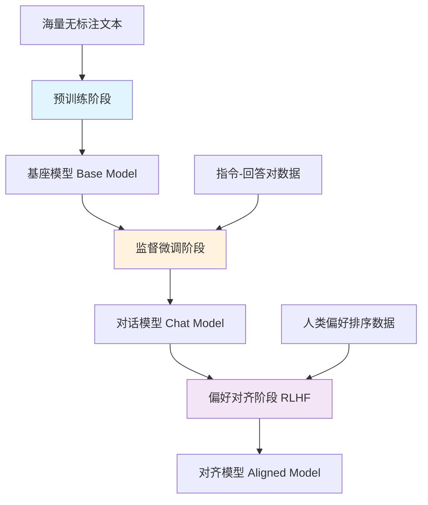
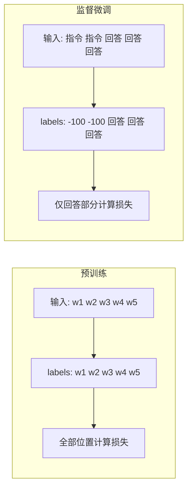

# 必知必会：大模型训练-预训练和监督微调异同详解

**AI-Compass** 致力于构建最全面、最实用、最前沿的AI技术学习和实践生态，通过六大核心模块的系统化组织，为不同层次的学习者和开发者提供完整学习路径。

* github地址：[AI-Compass👈：https://github.com/tingaicompass/AI-Compass](https://github.com/tingaicompass/AI-Compass)
* gitee地址：[AI-Compass👈：https://gitee.com/tingaicompass/ai-compass](https://gitee.com/tingaicompass/ai-compass)


🌟 如果本项目对您有所帮助，请为我们点亮一颗星！🌟

---

## 1. 预训练和监督微调概述

### 1.1 核心问题

> 预训练和监督微调有什么区别和相同之处？大模型预训练、监督微调和强化学习分别解决什么问题？

### 1.2 原文核心要点

> 预训练和监督微调是提升大模型能力的两种关键方法，它们都依赖于使用交叉熵损失来训练模型进行下一个词元的预测，从而最大化训练数据的语言模型概率。

大模型的训练过程可以概括为3个阶段，分别是预训练（pre-training）、监督微调和偏好对齐（preference alignment，也就是人类反馈强化学习），其中预训练主要是使用真实世界的语料库为模型注入大量的人类语言知识。通过这种方式得到的模型通常被称为"基座模型"（base model）。由于训练任务的设置，此时的模型对于输入更倾向于进行文字的续写，而其训练阶段的多样化数据本身也导致模型在输出文本时展现出较强的多样性。在监督微调阶段，模型训练需要大量的指令数据作为模型的提示词。这些提示词模拟了用户的对话输入，允许模型通过与这些模拟输入的交互来学习和适应多轮问答等复杂的对话状态。在这一过程中，指令数据作为大模型的输入会参与模型的注意力计算。然而，微调的目的是希望模型学到如何针对用户的指令、提问等，结合预训练时学到的知识，进行合理的回复。通过这种方式，模型被优化为能够理解和回应特定指令的对话模型（chat/instruct model）。监督微调阶段和指令微调阶段的训练设置与预训练阶段有很大的相似性。

### 1.3 通俗理解

#### 直观类比

想象你在培养一个实习生成为合格的员工：

- **预训练**就像让实习生上大学读四年书——学语文、数学、历史、物理……他什么都学了一点，具备了"通识"基础，但你问他"怎么写一封商务邮件"，他可能只会给你背一段《大学》。
- **监督微调**就像实习生入职后的岗前培训——你给他看100封优秀商务邮件范例（指令+回答对），让他模仿着写。几轮下来，他就学会了"收到指令→给出合理回复"的模式。
- **偏好对齐**就像老员工给他的邮件打分——"这封写得好，那封太生硬"，帮他进一步提升到"不仅能写，还写得让人满意"的水平。

#### 核心要点

- 预训练给模型"灌知识"，微调教模型"用知识"
- 两者都用交叉熵损失做下一个词预测，但损失计算范围不同
- 三阶段（预训练→微调→对齐）是当前大模型训练的标准流程

下图展示了大模型训练的三阶段流程：



上图展示了从原始数据到最终对齐模型的完整训练流程：预训练注入知识 → 微调学会指令遵循 → 对齐匹配人类偏好。

---

## 2. 核心区别：目标、数据与任务的本质差异

预训练和监督微调的核心差异源于"**通用能力构建**"与"**特定任务适配**"的分工，具体可从6个维度对比：

| 对比维度                | 预训练（Pre-training）                                  | 监督微调（Supervised Fine-tuning, SFT）                |
|-------------------------|---------------------------------------------------------|---------------------------------------------------------|
| **核心目标**            | 让模型学习**通用知识与基础表征**（如语言规律、视觉特征），具备"广谱认知能力" | 让预训练模型**适配具体任务**（如情感分析、目标检测），输出"任务专用能力" |
| **数据要求**            | - 数量大（通常百万/亿级样本）<br>- 类型杂（如全网文本、海量图片）<br>- 标注弱/无（如仅用文本自身做自监督） | - 数量小（通常千/万级样本）<br>- 类型专（仅任务相关数据，如"好评/差评"文本）<br>- 标注精（需明确标签，如"正面=1，负面=0"） |
| **任务类型**            | 以**自监督/弱监督任务**为主（无显式标签，用数据自身构造任务） | 以**监督学习任务**为主（有显式输入-输出标签对，任务目标明确） |
| **模型初始化**          | 从**随机参数**开始训练（模型初始无任何知识）             | 从**预训练完成的参数**开始训练（复用预训练的通用知识，避免从零开始） |
| **参数更新逻辑**        | 优化"通用表征损失"（如语言模型的"预测下一个词"损失），更新全部/大部分参数 | 优化"特定任务损失"（如分类任务的交叉熵损失），通常仅微调部分参数（或低学习率更新全部） |
| **输出产物**            | 基础模型（Foundation Model，如BERT-base、ViT-B），可适配多个下游任务 | 任务专用模型（如"BERT-情感分析模型""ViT-猫脸检测模型"），仅针对单一任务优化 |

### 2.1 实例辅助理解：以语言模型为例

- **预训练阶段**：用1000亿条全网文本（新闻、小说、论坛等无标注数据）训练GPT-3，任务是"给定前半句话，预测下一个词"（因果语言建模）。训练后，GPT-3能理解语法、语义，甚至生成通顺的句子，但不知道"如何判断情感"。
- **监督微调阶段**：用1万条带标签的"评论-情感"数据（如"这部电影超好看！→ 正面""服务太差了→负面"），以"输入评论→输出情感标签"为任务，微调GPT-3的参数。微调后，模型变成"GPT-3-情感分析模型"，能精准判断新评论的情感倾向。

### 2.2 通俗理解

#### 直观类比

想象一个学生的学习过程：

- **预训练**就像读完整个图书馆——读了无数本书，对世界有了基本认知，但如果你问他"请帮我总结这份报告"，他可能会给你背诵一段百科全书，因为他只学会了"续写"，没学会"听指令办事"。
- **监督微调**就像做专项习题——给他看大量"问题→标准答案"的范例，让他学会针对特定类型的问题给出对应格式的回答。

简单来说，预训练解决的是"懂不懂"的问题，监督微调解决的是"会不会用"的问题。

#### 核心要点

- 预训练数据量级大（亿级）且无标注，微调数据量级小（万级）但需精标注
- 预训练从随机参数起步，微调在预训练参数基础上进行
- 预训练产出通用基座模型，微调产出任务专用模型

### 2.3 小结

| 维度 | 说明 |
|------|------|
| 核心目标差异 | 预训练构建通用表征能力，微调适配具体任务 |
| 数据规模差异 | 预训练需亿级无标注数据，微调仅需万级精标注数据 |
| 初始化方式 | 预训练从随机参数开始，微调复用预训练权重 |
| 产物差异 | 预训练产出基座模型，微调产出任务专用模型 |
| 关键公式速查 | 预训练损失：$L = -\sum_{t} \log P(w_t \mid w_{<t})$；微调损失相同但仅对回答部分计算 |

---

## 3. 关键相同之处：底层逻辑与技术共性

尽管分工不同，预训练和监督微调本质上都是"模型通过数据学习规律"，共享3个核心技术逻辑：

### 3.1 均基于"梯度下降"的优化框架

两者的训练过程都遵循"损失计算→梯度反向传播→参数更新"的闭环：
- 预训练：计算"通用任务损失"（如BERT的掩码语言模型损失MLM），通过梯度下降更新参数，让模型更擅长"预测掩码词"（本质是学习语言规律）；
- 监督微调：计算"特定任务损失"（如分类任务的交叉熵损失），通过梯度下降微调参数，让模型更擅长"输出正确标签"。

### 3.2 均以"数据驱动"为核心

两者的性能都依赖数据的质量和相关性：
- 预训练的效果取决于"数据覆盖度"（数据越多样，模型通用能力越强）；
- 监督微调的效果取决于"数据匹配度"（数据与任务越贴合、标注越准，模型任务性能越好）。
> 注：若预训练数据与下游任务数据差异过大（如用"医学文献"预训练的模型，微调"儿童童话分类"任务），微调效果会显著下降——这也是"领域预训练"（如用法律文本预训练法律大模型）的由来。

### 3.3 均服务于"提升模型性能"的最终目标

两者是"递进关系"，而非独立流程：
- 预训练是"打地基"：没有预训练的通用知识，监督微调需要从零开始训练，不仅数据量需求暴增（可能需要百万级标注数据），还容易过拟合（模型只学懂训练数据，不会泛化）；
- 监督微调是"盖房子"：没有微调，预训练模型的通用能力无法落地到具体场景（如预训练BERT不能直接用于"简历筛选"，必须通过微调适配）。

### 3.4 通俗理解

#### 直观类比

无论是预训练还是微调，底层都是"给模型看数据、算差距、调参数"的循环过程，就像一个厨师学做菜：

- **梯度下降**就像厨师"尝一口→觉得咸了→少放盐→再尝"的迭代调味过程。预训练和微调都在做这件事，只是"目标口味"不同。
- **数据驱动**就像食材决定菜品质量——预训练阶段需要各种各样的食材（通用数据），微调阶段需要和目标菜品高度匹配的食材（任务数据）。

#### 核心要点

- 两者都遵循"损失计算→梯度反向传播→参数更新"的闭环
- 预训练看重数据覆盖度，微调看重数据匹配度
- 两者是"打地基+盖房子"的递进关系

### 3.5 小结

| 维度 | 说明 |
|------|------|
| 共享优化框架 | 均基于"损失计算→梯度反传→参数更新"的闭环 |
| 数据驱动核心 | 预训练看重数据覆盖度，微调看重数据匹配度 |
| 递进关系 | 预训练"打地基"，微调"盖房子"，两者缺一不可 |
| 领域预训练 | 当预训练数据与下游任务差异过大时，需进行领域预训练 |

---

## 4. 代码详细说明

对于诸如Llama、Baichuan、Qwen等纯解码器模型,在预训练阶段的主要训练任务是根据前面的文本词语信息去预测下一个词元(Next Token Prediction,NTP)。在这一过程中模型通过前文信息的注意力表征,以词表分类的方式逐步预测下一个词元,训练过程中通过控制注意力掩码(attention mask)来避免泄露信息。

```python
import torch
# 定义一个函数,用于生成因果掩码,确保在序列模型中,未来的位置不会影响当前位置
def _make_causal_mask(
    input_ids_shape: torch.Size,
    # 输入的尺寸信息,通常为(batch_size, sequence_length)
    dtype: torch.dtype,  # 掩码的数据类型
    device: torch.device,  # 运行设备信息,如CPU或GPU
    past_key_values_length: int = 0,  # 添加缺失的参数
):
    # 从输入尺寸中获取batch_size和sequence_length
    bsz, tgt_len = input_ids_shape

    # 初始化一个全为0的矩阵,大小为(tgt_len, tgt_len),用于存储掩码
    mask = torch.full((tgt_len, tgt_len), 0, device=device)

    # 创建一个条件掩码,用于填充矩阵的对角线以上部分
    mask_cond = torch.arange(mask.size(-1), device=device)

    # 使用条件掩码填充矩阵,对角线以上部分填充为1,以下部分保持为0
    # 这里使用了小于号和广播机制来实现对角线以上部分的填充
    mask.masked_fill_(mask_cond < (mask_cond + 1).view(mask.size(-1), 1), 1)

    # 将掩码的数据类型转换为传入的dtype参数指定的类型
    mask = mask.to(dtype)

    # 返回一个扩展后的掩码,用于因果语言模型中的自注意力机制
    # 这里使用None和expand方法来增加维度,以匹配模型的期望输入
    # past_key_values_length表示前文缓存的key和value的长度
    return mask[None, None, :, :].expand(
        # 扩展到batch_size和sequence_length
        bsz, 1, tgt_len,
        # 目标长度加上缓存的key和value的长度
        tgt_len + past_key_values_length
    )


# 测试代码
if __name__ == "__main__":
    print("=== 因果掩码生成函数测试 ===")

    # 测试参数
    batch_size = 2
    sequence_length = 4
    input_shape = torch.Size([batch_size, sequence_length])
    dtype = torch.float32
    device = torch.device("cpu")
    past_key_values_length = 0

    print(f"输入形状: {input_shape}")
    print(f"数据类型: {dtype}")
    print(f"设备: {device}")
    print(f"过去键值长度: {past_key_values_length}")

    # 生成因果掩码
    causal_mask = _make_causal_mask(input_shape, dtype, device, past_key_values_length)

    print(f"\n生成的因果掩码形状: {causal_mask.shape}")
    print("因果掩码内容:")
    print(causal_mask)


    # 展示掩码的作用
    print("\n=== 掩码的作用说明 ===")
    print("因果掩码用于确保在自注意力机制中，每个位置只能关注到它之前的位置，")
    print("从而保证模型在生成时不会看到未来的信息。")
    print("掩码中的1表示被屏蔽的位置，0表示可以关注的位置。")
```

```python
=== 因果掩码生成函数测试 ===
输入形状: torch.Size([2, 4])
数据类型: torch.float32
设备: cpu
过去键值长度: 0

生成的因果掩码形状: torch.Size([2, 1, 4, 4])
因果掩码内容:
tensor([[[[1., 0., 0., 0.],
          [1., 1., 0., 0.],
          [1., 1., 1., 0.],
          [1., 1., 1., 1.]]],


        [[[1., 0., 0., 0.],
          [1., 1., 0., 0.],
          [1., 1., 1., 0.],
          [1., 1., 1., 1.]]]])
```

纯解码器模型的单向特性要求模型在训练时，每个词元的预测仅依赖前面的词元。为了实现这一点，因果注意力掩码（causal attention mask）的设定使得模型能够在仅进行一次计算的前提下，自动形成对后续词元的遮蔽结果，而不需要任何重新计算。

在大语言模型的预训练阶段，通常采用逐词元（token-by-token）的方式进行自回归生成任务的损失计算。此时，输入序列 `input_ids` 与目标序列 `labels` 在内容上完全一致——模型的目标是根据前序上下文预测下一个词元，因此整个输入序列同时作为输入和监督信号。

进入监督微调（Supervised Fine-Tuning, SFT）阶段后，任务性质仍为生成式建模，模型继续执行逐词元预测。因此，可以沿用预训练阶段所使用的损失函数（如交叉熵损失）。然而，关键区别在于：**仅需对目标响应（即模型应生成的回答部分）计算损失，而应忽略指令、提示（prompt）等上下文部分的损失**。这一目标可通过将 `labels` 中不希望参与损失计算的位置设为 `ignore_index`（通常为 `-100`）来实现。PyTorch 的 `CrossEntropyLoss` 会自动跳过这些位置的梯度回传，从而确保模型仅在目标输出段上进行参数更新，有效提升其指令遵循能力。

### 4.1 核心参数辨析：input_ids、labels 与两类掩码的作用差异

- **`input_ids` 与 `labels`**：
  在预训练阶段，二者完全相同；而在监督微调阶段，`labels` 可根据任务需求进行掩码处理——将 prompt 部分对应的词元标记为 `-100`，仅保留回答部分的真实标签。这种设计使模型聚焦于学习"如何根据指令生成恰当响应"，而非简单复现输入。
  - 预训练阶段：如前所述，二者完全一致，共同构成模型的学习目标 —— 模型以 input_ids 为输入，以 labels（即 input_ids 本身）为基准计算损失，实现对通用语言知识的学习。
  - 监督微调阶段：二者的一致性仅体现在目标段落部分，而指令与提示词部分的 labels 被设为 - 100（忽略值）。这种差异化设置，是实现 "聚焦目标段落损失计算" 的核心手段，确保模型仅围绕指令遵循任务更新参数。

- **损失掩码（Loss Mask）与注意力掩码（Attention Mask）**：
  损失掩码用于控制哪些位置参与损失计算，常见实现方式即上述的 `labels = -100`。某些训练框架（如 Megatron-LM）也显式引入 `loss_mask` 张量，其功能与 `-100` 标记等价。  相比之下，注意力掩码主要用于处理变长序列的批处理（batching）：通过屏蔽填充（padding）位置，防止模型在自注意力机制中关注无效 token。二者目的不同——**损失掩码影响梯度更新，注意力掩码影响信息流动**，不可混淆。
  - `损失掩码（Loss Mask）`：仅在监督微调阶段发挥作用，核心功能是标识序列中需计算损失的位置。例如在 Megatron-LM 等训练框架中，损失掩码作为输入参数传入模型，直接指定哪些位置需参与损失计算，其作用与 "将 labels 设为 - 100" 本质一致，均是对损失计算范围的精准控制。
  - `注意力掩码（Attention Mask）`：与损失计算无关，其核心作用是解决批次数据中的序列长度对齐问题。当一个训练批次中包含长短不一的输入序列时，需通过填充（Padding）将序列长度统一，而注意力掩码会标记出 "填充位置"，让模型在计算注意力时忽略这些无意义的填充词元，避免影响注意力权重的合理分配。

综上，无论是预训练还是监督微调，模型的核心训练目标始终是优化"下一个词元预测"能力。监督微调的关键创新在于引入**选择性损失计算机制**：在相同上下文条件下，仅对期望输出段进行监督信号回传。这种策略显著增强了模型对指令的理解与响应生成能力，是实现高效对齐（alignment）的重要技术手段。

### 4.2 通俗理解

#### 直观类比

想象你在教一个学生做阅读理解题：

- **预训练时的损失计算**就像让学生读完整篇文章后，每个字都算分——文章的每个词都是"考点"，学生需要学会预测每一个下一个字。
- **监督微调时的损失计算**就像只看学生的"答题区"——题目（指令/prompt）部分不打分，只有回答部分才计入成绩。通过把题目部分的标签设为 -100，就等于告诉阅卷老师："这些位置不用打分。"

而两种掩码的区别也很好理解：
- **损失掩码**决定"阅卷时哪些答案算分"（影响学习什么）
- **注意力掩码**决定"考试时学生能看到哪些题目信息"（影响信息如何流动）

#### 核心要点

- 预训练阶段 input_ids = labels，全序列参与损失计算
- 监督微调阶段将 prompt 部分 labels 设为 -100，只对回答部分计算损失
- 损失掩码管"学什么"，注意力掩码管"看什么"

> 建立了直觉之后，下面我们用流程图来直观展示两个阶段的损失计算差异。

下图展示了预训练与监督微调的损失计算差异：



上图展示了两个阶段损失计算范围的核心差异：预训练全序列参与，微调仅回答部分参与。

### 4.3 技术原理与公式推导

> 建立了直觉之后，下面用数学公式来严格定义预训练和监督微调的核心机制。

#### 预训练损失函数（因果语言模型）

预训练阶段的目标是最大化整个序列的对数似然，等价于最小化以下交叉熵损失：

$$
L_{\text{PT}} = -\frac{1}{T}\sum_{t=1}^{T} \log P_\theta(w_t \mid w_1, w_2, \ldots, w_{t-1})
$$

#### 符号说明

| 符号 | 含义 | 示例值 |
|------|------|--------|
| $L_{\text{PT}}$ | 预训练阶段的交叉熵损失 | 7.59 |
| $T$ | 序列长度（词元数） | 512 |
| $w_t$ | 序列中第 $t$ 个词元 | "模型" |
| $P_\theta$ | 参数为 $\theta$ 的模型预测的条件概率 | 0.85 |
| $\theta$ | 模型可训练参数 | — |

#### 监督微调损失函数

微调阶段仅对回答部分计算损失，指令部分被掩码排除：

$$
L_{\text{SFT}} = -\frac{1}{|\mathcal{R}|}\sum_{t \in \mathcal{R}} \log P_\theta(w_t \mid w_1, w_2, \ldots, w_{t-1})
$$

其中 $\mathcal{R}$ 表示回答部分的词元位置集合。在实现中，通过将非回答位置的 labels 设为 $-100$，使 PyTorch 的 `CrossEntropyLoss` 自动跳过这些位置。

| 符号 | 含义 | 示例值 |
|------|------|--------|
| $L_{\text{SFT}}$ | 监督微调阶段的损失 | 0.231 |
| $\mathcal{R}$ | 回答部分的词元位置集合 | {3, 4, 5}（序列中第3-5个位置是回答） |
| $\|\mathcal{R}\|$ | 回答部分的词元数量 | 3 |

#### 梯度下降参数更新公式

无论预训练还是微调，参数更新都遵循梯度下降框架：

$$
\theta_{t+1} = \theta_t - \eta \cdot \nabla_\theta L(\theta_t)
$$

| 符号 | 含义 | 示例值 |
|------|------|--------|
| $\theta_t$ | 第 $t$ 步的模型参数 | — |
| $\eta$ | 学习率 | $1 \times 10^{-5}$（微调）/ $1 \times 10^{-4}$（预训练） |
| $\nabla_\theta L$ | 损失对参数的梯度 | — |

两个阶段的区别仅在于损失 $L$ 的计算范围不同：预训练用 $L_{\text{PT}}$（全序列），微调用 $L_{\text{SFT}}$（仅回答部分）。

#### Softmax 概率计算

模型在每个位置输出 logits 向量 $z \in \mathbb{R}^V$，通过 softmax 转换为概率分布：

$$
P_\theta(w_t = v_j \mid w_{<t}) = \frac{\exp(z_j)}{\sum_{k=1}^{V} \exp(z_k)}
$$

| 符号 | 含义 | 示例值 |
|------|------|--------|
| $z_j$ | 词元 $v_j$ 对应的 logit 值 | 2.5 |
| $V$ | 词表大小 | 32000（LLaMA）/ 151936（Qwen） |
| $v_j$ | 词表中第 $j$ 个词元 | "学习" |

#### 数值计算示例

**场景**：假设一个简化的序列，词表大小 V=5，序列长度 T=4

**预训练损失计算**：

模型对每个位置的正确词元预测概率分别为：0.8, 0.6, 0.9, 0.7

$$
L_{\text{PT}} = -\frac{1}{4}(\log 0.8 + \log 0.6 + \log 0.9 + \log 0.7) = -\frac{1}{4}(-0.223 - 0.511 - 0.105 - 0.357) = 0.299
$$

**监督微调损失计算**：

假设前2个位置是指令（labels=-100），后2个位置是回答，预测概率为 0.9 和 0.7：

$$
L_{\text{SFT}} = -\frac{1}{2}(\log 0.9 + \log 0.7) = -\frac{1}{2}(-0.105 - 0.357) = 0.231
$$

**对比**：微调损失（0.231）仅基于回答部分的2个位置计算，预训练损失（0.299）基于全部4个位置。这直观体现了两种损失函数的范围差异。

### 4.4 损失计算代码

具体代码如下所示：

```python
import torch
import torch.nn as nn
from torch.nn import CrossEntropyLoss
import numpy as np

def demonstrate_loss_calculation():
    """
    这个函数模拟了语言模型训练时的损失计算，包括：
    1. 输入数据的准备
    2. shift操作的原理和实现
    3. 张量形状变换
    4. 交叉熵损失计算
    """

    # 模拟配置参数
    class Config:
        vocab_size = 1000  # 词汇表大小

    config = Config()

    # 1. 准备输入数据
    batch_size = 2      # 批次大小
    seq_len = 5         # 序列长度
    vocab_size = config.vocab_size

    print(f"\n1. 输入数据准备:")
    print(f"   batch_size = {batch_size}")
    print(f"   seq_len = {seq_len}")
    print(f"   vocab_size = {vocab_size}")

    # - **logits**: 模型输出的未归一化概率分布
    # - 形状: `[batch_size, seq_len, vocab_size]`
    # - 含义: 每个位置对词汇表中每个词的预测分数

    # - **labels**: 真实的token序列
    # - 形状: `[batch_size, seq_len]`
    # - 含义: 每个位置的真实token ID
    # 模拟 logits (模型输出的未归一化概率分布)
    # 形状: [batch_size, seq_len, vocab_size]
    torch.manual_seed(42)  # 设置随机种子以便复现
    logits = torch.randn(batch_size, seq_len, vocab_size)

    # 模拟 labels (真实的token序列)
    # 形状: [batch_size, seq_len]
    labels = torch.randint(0, vocab_size, (batch_size, seq_len))

    print(f"\n2. 原始数据形状:")
    print(f"   logits.shape = {logits.shape}  # [batch_size, seq_len, vocab_size]")
    print(f"   labels.shape = {labels.shape}  # [batch_size, seq_len]")

    # 显示具体的数值示例（只显示前几个值）
    print(f"\n3. 具体数值示例:")
    print(f"   labels[0] = {labels[0].tolist()}")  # 第一个样本的标签序列
    print(f"   labels[1] = {labels[1].tolist()}")  # 第二个样本的标签序列

    # 显示logits的部分数值（只显示第一个样本的前3个位置的前5个词汇的概率）
    print(f"第一个样本第一个位置的前5个词汇概率logits[0, 0, :5] = {logits[0, 0, :5].tolist()}")  # 第一个样本第一个位置的前5个词汇概率

    if labels is not None:
        print(f"\n4. Shift操作 - 防止信息泄露:")
        print("   在语言模型中，我们要预测下一个token，所以需要错位对齐：")
        print("   - 输入序列: [w1, w2, w3, w4, w5]")
        print("   - 预测目标: [w2, w3, w4, w5, w6]")
        print("   - 因此需要将logits和labels都进行shift操作")
        #在语言模型中，我们的目标是**预测下一个token**。给定前面的token序列，模型需要预测紧接着的下一个token。
        # shift 的目的是错一位, 这样做是为了防止信息泄露
        shift_logits = logits[..., :-1, :].contiguous()  # 去掉最后一个位置的预测
        shift_labels = labels[..., 1:].contiguous()      # 去掉第一个位置的标签

        print(f"\n5. Shift后的形状:")
        print(f"   shift_logits.shape = {shift_logits.shape}  # [batch_size, seq_len-1, vocab_size]")
        print(f"   shift_labels.shape = {shift_labels.shape}  # [batch_size, seq_len-1]")

        print(f"\n6. Shift操作的具体效果:")
        print("   原始labels[0]:", labels[0].tolist())
        print("   shift后labels[0]:", shift_labels[0].tolist())
        print("   解释: 我们用位置0-3的logits去预测位置1-4的tokens")

        # 将输出得分和对应的标签展平成可以计算交叉熵的方式
        print(f"\n7. 张量展平操作:")
        print("   为了计算交叉熵损失，需要将张量展平：")

        # 展平前的形状
        print(f"   展平前 shift_logits: {shift_logits.shape}")
        print(f"   展平前 shift_labels: {shift_labels.shape}")

        # 执行展平
        # CrossEntropyLoss函数期望的输入格式：
        # - 预测值: `[N, C]` 其中N是样本数，C是类别数
        # - 标签: `[N]` 其中N是样本数
        # - 将所有批次的所有位置合并成独立的预测任务
        # - 每个预测任务都是一个vocab_size分类问题
        # - 总预测任务数: `batch_size × (seq_len - 1)`

        shift_logits_flat = shift_logits.view(-1, config.vocab_size)
        shift_labels_flat = shift_labels.view(-1)

        print(f"   展平后 shift_logits: {shift_logits_flat.shape}")
        print(f"   展平后 shift_labels: {shift_labels_flat.shape}")

        print(f"\n8. 展平操作的含义:")
        print(f"   - 将所有批次的所有位置合并成一个大的预测任务")
        print(f"   - 总共有 {batch_size} × {seq_len-1} = {batch_size * (seq_len-1)} 个预测任务")
        print(f"   - 每个预测任务都是一个 {vocab_size} 分类问题")

        # 并行训练需要的相关操作
        shift_labels_flat = shift_labels_flat.to(shift_logits_flat.device)

        # 损失函数计算
        loss_fct = CrossEntropyLoss()
        loss = loss_fct(shift_logits_flat, shift_labels_flat)

        print(f"\n9. 交叉熵损失计算:")
        print(f"   使用CrossEntropyLoss计算损失")
        print(f"   最终损失值: {loss.item():.6f}")

        # 详细解释交叉熵计算过程
        print(f"\n10. 交叉熵损失的详细计算过程:")

        # 手动计算一个样本的交叉熵来演示
        sample_idx = 0  # 选择第一个预测任务
        sample_logits = shift_logits_flat[sample_idx]  # 形状: [vocab_size]
        sample_label = int(shift_labels_flat[sample_idx].item())  # 标量

        # 计算softmax概率
        sample_probs = torch.softmax(sample_logits, dim=0)

        print(f"   示例 - 第{sample_idx+1}个预测任务:")
        print(f"   真实标签: {sample_label}")
        print(f"   预测概率分布的前5个值: {sample_probs[:5].tolist()}")
        print(f"   真实标签对应的预测概率: {sample_probs[sample_label].item():.6f}")
        print(f"   该样本的交叉熵: {-torch.log(sample_probs[sample_label]).item():.6f}")

        print(f"\n11. 损失函数的意义:")
        print("   - 交叉熵损失衡量预测分布与真实分布的差异")
        print("   - 损失越小，说明模型预测越准确")
        print("   - 通过反向传播，损失会指导模型参数的更新")

        # 计算准确率作为额外信息
        with torch.no_grad():
            predictions = torch.argmax(shift_logits_flat, dim=1)
            accuracy = (predictions == shift_labels_flat).float().mean()
            print(f"   当前批次的预测准确率: {accuracy.item():.4f}")

        print(f"\n12. 总结:")
        print("   损失计算的完整流程:")
        print("   1. 输入logits和labels")
        print("   2. 执行shift操作防止信息泄露")
        print("   3. 展平张量以适应交叉熵函数")
        print("   4. 计算交叉熵损失")
        print("   5. 使用损失进行反向传播和参数更新")

        return loss

if __name__ == "__main__":
    # 运行演示
    final_loss = demonstrate_loss_calculation()
    if final_loss is not None:
        print(f"\n最终计算得到的损失值: {final_loss.item():.6f}")
    else:
        print("\n未计算损失值（labels为None）")
```

```python
1. 输入数据准备:
   batch_size = 2
   seq_len = 5
   vocab_size = 1000

2. 原始数据形状:
   logits.shape = torch.Size([2, 5, 1000])  # [batch_size, seq_len, vocab_size]
   labels.shape = torch.Size([2, 5])  # [batch_size, seq_len]

3. 具体数值示例:
   labels[0] = [698, 775, 662, 655, 103]
   labels[1] = [258, 717, 739, 954, 860]
   logits[0, 0, :5] = [1.9269150495529175, 1.4872841835021973, 0.9007171988487244, -2.1055214405059814, 0.6784184575080872]

4. Shift操作 - 防止信息泄露:
   在语言模型中，我们要预测下一个token，所以需要错位对齐：
   - 输入序列: [w1, w2, w3, w4, w5]
   - 预测目标: [w2, w3, w4, w5, w6]
   - 因此需要将logits和labels都进行shift操作

5. Shift后的形状:
   shift_logits.shape = torch.Size([2, 4, 1000])  # [batch_size, seq_len-1, vocab_size]
   shift_labels.shape = torch.Size([2, 4])  # [batch_size, seq_len-1]

6. Shift操作的具体效果:
   原始labels[0]: [698, 775, 662, 655, 103]
   shift后labels[0]: [775, 662, 655, 103]
   解释: 我们用位置0-3的logits去预测位置1-4的tokens

7. 张量展平操作:
   为了计算交叉熵损失，需要将张量展平：
   展平前 shift_logits: torch.Size([2, 4, 1000])
   展平前 shift_labels: torch.Size([2, 4])
   展平后 shift_logits: torch.Size([8, 1000])
   展平后 shift_labels: torch.Size([8])

8. 展平操作的含义:
   - 将所有批次的所有位置合并成一个大的预测任务
   - 总共有 2 × 4 = 8 个预测任务
   - 每个预测任务都是一个 1000 分类问题

9. 交叉熵损失计算:
   使用CrossEntropyLoss计算损失
   最终损失值: 7.593142

10. 交叉熵损失的详细计算过程:
   示例 - 第1个预测任务:
   真实标签: 775
   预测概率分布的前5个值: [0.004181262105703354, 0.002693879185244441, 0.0014984261943027377, 7.41382609703578e-05, 0.0011997539550065994]
   真实标签对应的预测概率: 0.000414
   该样本的交叉熵: 7.789888

11. 损失函数的意义:
   - 交叉熵损失衡量预测分布与真实分布的差异
   - 损失越小，说明模型预测越准确
   - 通过反向传播，损失会指导模型参数的更新
   当前批次的预测准确率: 0.0000

12. 总结:
   损失计算的完整流程:
   1. 输入logits和labels
   2. 执行shift操作防止信息泄露
   3. 展平张量以适应交叉熵函数
   4. 计算交叉熵损失
   5. 使用损失进行反向传播和参数更新

最终计算得到的损失值: 7.593142

```

---

## 5. 高频面试题及答案

### Q1: 请简述预训练和监督微调的核心区别是什么?（基础）

**答案**：
预训练是让模型学习通用知识（广谱认知能力），监督微调是让预训练模型适配具体任务（任务专用能力）。

**详细说明**：

| 要点 | 说明 |
|------|------|
| 核心目标 | 预训练：通用知识与基础表征；微调：适配具体任务 |
| 数据要求 | 预训练：海量无标注数据（亿级）；微调：少量精标注数据（万级） |
| 任务类型 | 预训练：自监督/弱监督（如预测下一个词）；微调：监督学习（显式标签对） |
| 模型初始化 | 预训练：随机参数；微调：复用预训练参数 |
| 输出产物 | 预训练：基础模型（适配多任务）；微调：任务专用模型 |

---

### Q2: 在大语言模型训练中,input_ids 和 labels 在预训练和监督微调阶段有什么区别?（进阶）

**答案**：
预训练阶段两者完全相同，微调阶段将指令部分 labels 设为 -100，仅对回答部分计算损失。

**详细说明**：

| 要点 | 说明 |
|------|------|
| 预训练阶段 | input_ids = labels，整个序列同时作为输入和监督信号 |
| 微调阶段 | labels 中指令部分设为 -100（ignore_index），仅回答部分保留真实标签 |
| 实现原理 | PyTorch CrossEntropyLoss 自动跳过 -100 位置的梯度回传 |
| 设计目的 | 使模型聚焦于学习"如何根据指令生成恰当响应" |

---

### Q3: 什么是因果注意力掩码(causal attention mask)?它的作用是什么?（基础）

**答案**：
因果注意力掩码确保自注意力机制中每个位置只能看到它之前的位置，防止未来信息泄露。

**详细说明**：

| 要点 | 说明 |
|------|------|
| 核心作用 | 保证自回归生成时模型不会看到未来的信息 |
| 实现方式 | 构建下三角矩阵，对角线以上位置被屏蔽 |
| 效率优势 | 一次计算即可形成对后续词元的遮蔽，无需重新计算 |
| 适用范围 | 纯解码器模型（如 LLaMA、GPT、Qwen 等） |

---

### Q4: 为什么在语言模型训练时需要进行 shift 操作?（进阶）

**答案**：
Shift 操作将 logits 和 labels 错位对齐，实现"用前文预测下一个词"的训练目标，防止信息泄露。

**详细说明**：

| 要点 | 说明 |
|------|------|
| 目的 | 实现 Next Token Prediction 的训练目标 |
| logits shift | `logits[..., :-1, :]` — 去掉最后一个位置的预测 |
| labels shift | `labels[..., 1:]` — 去掉第一个位置的标签 |
| 对齐效果 | 位置 i 的 logits 对应位置 i+1 的 labels |
| 防止泄露 | 确保模型在位置 i 不能同时看到 i 位置的标签 |

---

### Q5: 请解释损失掩码(Loss Mask)和注意力掩码(Attention Mask)的区别。（基础）

**答案**：
损失掩码控制哪些位置参与梯度更新（影响"学什么"），注意力掩码控制自注意力中的信息流动（影响"看什么"）。

**详细说明**：

| 要点 | 损失掩码 | 注意力掩码 |
|------|---------|-----------|
| 作用阶段 | 主要在监督微调 | 预训练和微调都使用 |
| 核心功能 | 控制损失计算范围 | 控制注意力信息流动 |
| 实现方式 | labels=-100 或显式 loss_mask | 标记 padding 位置 |
| 影响对象 | 梯度更新 | 注意力权重 |
| 典型场景 | 微调时忽略指令部分 | 处理变长序列对齐 |

---

### Q6: 在交叉熵损失计算前,为什么需要对张量进行展平操作?（进阶）

**答案**：
PyTorch CrossEntropyLoss 要求预测值为 [N, C]、标签为 [N] 的格式，需要将多维张量展平以满足接口要求。

**详细说明**：

| 要点 | 说明 |
|------|------|
| 输入格式要求 | 预测值 [N, C]，标签 [N]，N=样本数，C=类别数 |
| 原始形状 | logits: [batch, seq_len-1, vocab_size]，labels: [batch, seq_len-1] |
| 展平操作 | logits → [batch×(seq_len-1), vocab_size]，labels → [batch×(seq_len-1)] |
| 本质含义 | 将所有位置的预测视为独立的 vocab_size 分类任务 |

---

### Q7: 预训练和监督微调在技术实现上有哪些共性?为什么说它们是"递进关系"?（进阶）

**答案**：
两者都基于梯度下降优化、都以数据驱动、都使用交叉熵损失；预训练是"打地基"，微调是"盖房子"，缺一不可。

**详细说明**：

| 要点 | 说明 |
|------|------|
| 优化框架 | 均遵循"损失计算→梯度反传→参数更新"闭环 |
| 数据驱动 | 预训练看重数据覆盖度，微调看重数据匹配度 |
| 损失函数 | 都使用交叉熵损失做下一个词元预测 |
| 递进关系 | 预训练构建通用知识基础，微调将知识适配到具体任务 |
| 缺少预训练 | 微调需从零开始，数据需求暴增且易过拟合 |
| 缺少微调 | 预训练模型通用能力无法落地到具体场景 |

---

### Q8: 在监督微调阶段,如何通过损失计算机制实现"指令遵循"能力?（进阶）

**答案**：
通过选择性损失计算机制——将指令部分 labels 设为 -100，仅对回答部分计算损失和梯度回传。

**详细说明**：

| 要点 | 说明 |
|------|------|
| 数据构造 | 完整序列=[指令tokens]+[回答tokens]，labels 中指令部分=-100 |
| 损失计算 | CrossEntropyLoss 自动跳过 -100 位置 |
| 梯度影响 | 仅回答部分的预测参与梯度回传 |
| 学习效果 | 模型学会"理解指令"但不被要求"复述指令" |
| 能力提升 | 参数更新聚焦于生成恰当回答，提升指令遵循能力 |

---

### Q9: 如果预训练数据与下游任务数据差异过大会有什么问题?如何解决?（综合）

**答案**：
会导致知识不匹配、微调效果下降、数据需求增加。解决方案包括领域预训练、领域适应性微调和数据增强。

**详细说明**：

| 要点 | 说明 |
|------|------|
| 知识不匹配 | 预训练学到的词汇和语言模式与下游任务不符 |
| 领域预训练 | 使用目标领域大规模无标注数据进行二次预训练 |
| 领域适应性微调 | 先用领域无标注数据微调，再用标注数据微调 |
| 数据增强 | 增加标注数据量或使用数据合成技术 |
| 选择合适基座 | 直接选择与目标领域接近的预训练模型 |

---

### Q10: 请从完整生命周期角度,说明预训练、监督微调和偏好对齐三个阶段的关系与作用。（综合）

**答案**：
三阶段遵循"通用能力构建→任务适配→人类偏好对齐"的范式，是当前大模型开发的标准流程。

**详细说明**：

| 阶段 | 目标 | 数据 | 产物 |
|------|------|------|------|
| 预训练 | 学习通用语言知识 | 大规模无标注语料 | 基座模型 |
| 监督微调 | 学会理解和遵循指令 | 高质量指令-回答对 | 对话模型 |
| 偏好对齐 | 输出符合人类偏好 | 人类标注偏好排序 | 对齐模型 |

三者是递进关系：预训练提供知识基础 → 微调实现任务适配 → 对齐确保输出质量和安全性。缺少任何一个阶段都会导致模型能力不完整。

---

## 6. 大厂常见面试题

本节面试题来源于互联网公开的大厂面试真题和高频考点。

### Q11: 什么是灾难性遗忘（Catastrophic Forgetting）？在微调大模型时如何缓解？（进阶）

**出处**：字节跳动/阿里巴巴 NLP算法工程师面试

**答案**：
灾难性遗忘是指模型在新任务上微调后，丧失了预训练阶段学到的通用知识。简单来说，就像一个人专注学新技能后把老技能忘了。

**详细说明**：

| 缓解方法 | 原理 | 适用场景 |
|---------|------|---------|
| 弹性权重整合（EWC） | 对重要参数施加约束，防止大幅偏移 | 多任务学习场景 |
| 渐进解冻（Progressive Freezing） | 先冻结底层参数，仅微调顶层，逐步解冻 | 小数据微调 |
| 学习率调度 | 使用较小的学习率微调，避免破坏预训练特征 | 通用微调 |
| 混合训练 | 在微调数据中混入部分预训练数据 | 领域微调 |
| LoRA/PEFT | 仅训练少量新增参数，保持主体不变 | 资源受限场景 |

---

### Q12: 增量预训练（Continue PreTraining）和监督微调（SFT）有什么区别？应该如何选择？（综合）

**出处**：百度/美团 大模型工程师面试

**答案**：
增量预训练是用领域语料继续预训练以注入领域知识，SFT 是用指令-回答对数据让模型学会遵循指令。两者解决的问题不同：前者解决"知不知道"，后者解决"会不会用"。

**详细说明**：

| 维度 | 增量预训练 | 监督微调（SFT） |
|------|----------|----------------|
| 目的 | 注入领域知识 | 激发指令遵循能力 |
| 数据 | 领域无标注文本（GB级） | 高质量指令-回答对（万级） |
| 训练方式 | 自回归语言建模 | 仅对回答部分计算损失 |
| 典型场景 | 医学、法律、金融等垂类领域 | 对话、问答、摘要等任务 |
| 选型建议 | 通用模型缺乏领域知识时使用 | 模型有知识但不会对话时使用 |

**实际案例**：

假设要构建一个法律问答助手：
1. **先增量预训练**：用100GB法律文献、法规条文进行继续预训练，让模型理解法律术语和逻辑
2. **再SFT**：用5万条"法律问题→专业回答"的指令数据进行微调，让模型学会针对法律问题给出结构化回答

---

### Q13: 大模型训练为什么选择交叉熵损失而不是MSE损失？（进阶）

**出处**：腾讯/华为 算法工程师面试

**答案**：
交叉熵损失在分类任务中梯度更大、收敛更快，且与 softmax 配合使用时数学性质更优。MSE 在分类任务中存在梯度消失问题。

**公式对比**：

交叉熵损失：

$$
L_{\text{CE}} = -\sum_{j=1}^{V} y_j \log p_j = -\log p_c
$$

其中 $y_j$ 是 one-hot 标签，$p_c$ 是正确类别的预测概率。其对 logit $z_c$ 的梯度为 $p_c - 1$，预测越错梯度越大。

MSE 损失：

$$
L_{\text{MSE}} = \sum_{j=1}^{V} (y_j - p_j)^2
$$

其对 logit 的梯度包含 $p_j(1-p_j)$ 项，当 $p_j$ 接近 0 或 1 时梯度趋近于 0（梯度消失）。

**详细说明**：

| 对比维度 | 交叉熵损失 | MSE 损失 |
|---------|-----------|---------|
| 梯度特性 | 预测错误时梯度大，收敛快 | 预测错误时可能梯度消失 |
| 数学配合 | 与 softmax 配合，梯度形式简洁（$p_c - 1$） | 与 softmax 配合梯度复杂（含 $p(1-p)$ 项） |
| 概率解释 | 直接衡量预测分布与真实分布的距离 | 衡量数值差异，无概率意义 |
| 适用场景 | 分类/生成任务（离散输出） | 回归任务（连续输出） |

---

### Q14: 多轮对话场景下，SFT的损失计算有什么特殊处理？（综合）

**出处**：阿里巴巴/字节跳动 大模型训练工程师面试（预测题）

**答案**：
多轮对话中，每轮的用户输入（指令部分）labels 均设为 -100，仅对每轮的模型回答部分计算损失，同时需要正确处理多轮的拼接和 attention mask。

**详细说明**：

| 要点 | 说明 |
|------|------|
| 数据格式 | `[指令1][回答1][指令2][回答2]...` 拼接为完整序列 |
| Labels 处理 | 所有指令部分设为 -100，仅回答部分保留真实 token id |
| Attention Mask | 因果掩码确保当前回答可以看到之前所有轮次的上下文 |
| Loss 计算 | 仅在回答位置计算交叉熵，但注意力可访问完整历史 |
| 常见陷阱 | 多轮拼接时要正确处理分隔符和轮次边界 |

---

## 总结

### 核心知识点回顾

| 知识点 | 核心内容 |
|--------|---------|
| 预训练目标 | 从海量无标注数据中学习通用语言知识，产出基座模型 |
| 监督微调目标 | 用指令-回答对数据训练模型遵循指令，产出对话模型 |
| 核心差异 | 数据量级、标注要求、初始化方式、输出产物不同 |
| 关键共性 | 均基于梯度下降、数据驱动、交叉熵损失 |
| input_ids vs labels | 预训练相同，微调中 labels 的指令部分设为 -100 |
| 损失掩码 vs 注意力掩码 | 损失掩码管"学什么"，注意力掩码管"看什么" |
| Shift 操作 | 错位对齐实现 Next Token Prediction，防止信息泄露 |
| 三阶段流程 | 预训练→监督微调→偏好对齐，递进构建完整能力 |

### 思维导图

```
大模型训练：预训练与监督微调
├── 核心区别
│   ├── 目标：通用知识 vs 任务适配
│   ├── 数据：亿级无标注 vs 万级精标注
│   ├── 初始化：随机参数 vs 预训练参数
│   └── 产物：基座模型 vs 任务专用模型
├── 关键共性
│   ├── 梯度下降优化框架
│   ├── 数据驱动核心
│   └── 交叉熵损失函数
├── 损失计算机制
│   ├── Shift 操作防止信息泄露
│   ├── 预训练：全序列计算损失
│   ├── 微调：仅回答部分计算损失（labels=-100）
│   └── 展平张量适配 CrossEntropyLoss
├── 两类掩码
│   ├── 损失掩码：控制梯度更新范围
│   └── 注意力掩码：控制信息流动方向
└── 三阶段训练范式
    ├── 预训练：灌知识
    ├── 监督微调：用知识
    └── 偏好对齐：对齐人类偏好
```

---

## 参考文献

<!-- Reviewed: 2026-02-13, 重新审校：修正文字错误(2处"从"字多余)/结构完整/通俗化充分/3个Mermaid图/8个$$公式+符号表+数值示例/14个面试题 -->

**AI-Compass** 致力于构建最全面、最实用、最前沿的AI技术学习和实践生态，通过六大核心模块的系统化组织，为不同层次的学习者和开发者提供完整学习路径。

* github地址：[AI-Compass👈：https://github.com/tingaicompass/AI-Compass](https://github.com/tingaicompass/AI-Compass)
* gitee地址：[AI-Compass👈：https://gitee.com/tingaicompass/ai-compass](https://gitee.com/tingaicompass/ai-compass)


🌟 如果本项目对您有所帮助，请为我们点亮一颗星！🌟
