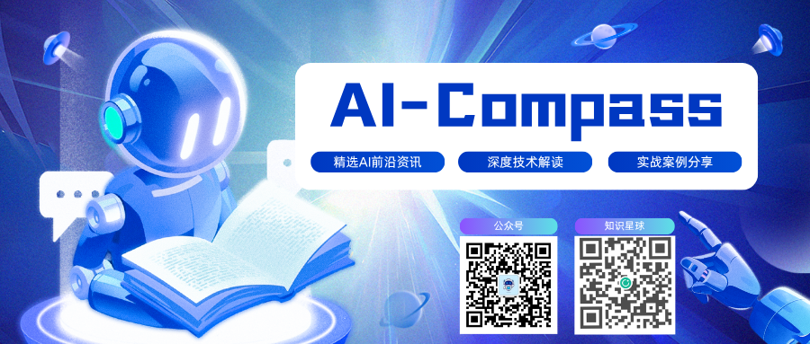
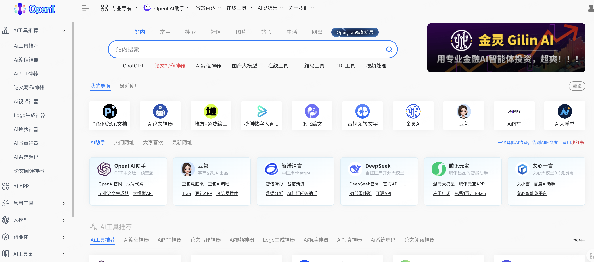
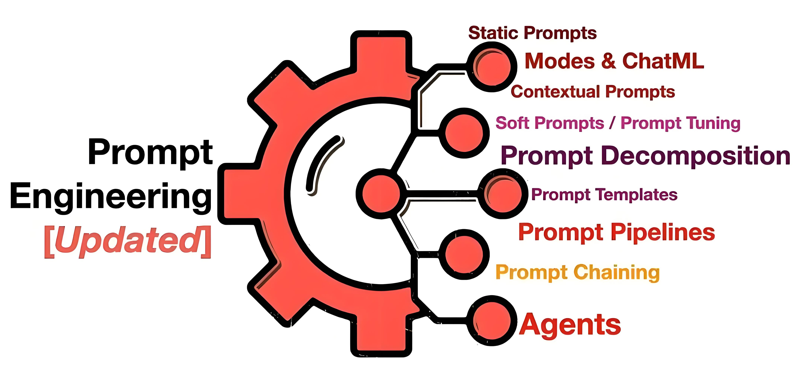
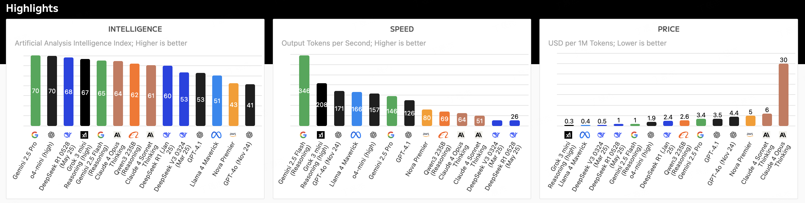

<p align="center">
  
</p>

<p align="center">
  <a href="https://github.com/tingaicompass/AI-Compass/stargazers"></a>
  <a href="https://gitee.com/tingaicompass/ai-compass"></a>
  <a href="./picture/main/wx.png"></a>
  <a href="https://blog.csdn.net/sinat_39620217?type=blog"></a>
  <a href="./picture/minor/KnowledgePlanet.md"></a>
  <a href="https://www.zhihu.com/people/tingaicompass"></a>
  <a href="https://juejin.cn/user/4020284493662029"></a>
  <a href="https://space.coze.cn/coding-expert-runtime/276757782274?task_id=7532330670594277651"></a>
</p>

[[中文](./README.md)] | [[English](./README-EN.md)] | [[Website](https://space.coze.cn/coding-expert-runtime/276757782274?task_id=7532330670594277651)]

# AI-Compass

**AI-Compass** is an open-source learning and practice ecosystem for the AI landscape. It helps both newcomers and experienced builders navigate major technical directions with curated resources, practical guidance, and a structure that supports long-term study and real project work.

The repository connects foundations with current practice across language and multimodal models, machine learning, computer vision, NLP, recommender systems, reinforcement learning, RAG, agents, GraphRAG, and engineering workflows from training and inference to product delivery.

[AI Compass Knowledge Planet coupon](./picture/minor/KnowledgePlanet.md)

**One-line installation through a coding agent**

If you use Claude Code, Codex, Cursor, Windsurf, or another coding agent, send it the following prompt:

```text
If AI-Compass is not already available on this machine, clone https://github.com/tingaicompass/AI-Compass.git first. Then follow https://raw.githubusercontent.com/tingaicompass/AI-Compass/main/Install.md to install it as a local knowledge-base skill that both Codex and Claude Code can use. When finished, report the installation path, verification results, and whether the client needs to be restarted.
```

This prompt instructs the coding agent to clone the repository when needed, run the root installation script, and verify the symbolic links. Afterward, you can ask it directly about AI technologies, models, projects, and weekly updates.

## Contents

- [Project Positioning](#-project-positioning)
- [Submit a Resource](#-submit-a-resource)
- [Weekly Highlights](#-weekly-highlights)
- [Module Guide](#-module-guide)
  - [Blog](#-blog)
  - [Code](#-code)
  - [Basic Knowledge](#-basic-knowledge)
  - [Technical Frameworks](#-technical-frameworks)
  - [Application Practice](#-application-practice)
  - [Products and Tools](#-products-and-tools)
  - [Learning Resources](#-learning-resources)
  - [Community and Platforms](#-community-and-platforms)
  - [Enterprise Open Source](#-enterprise-open-source)
- [Future Vision](#-future-vision)
- [Star History](#star-history)

> All links are directly accessible.

## Project Positioning

AI-Compass aims to be a practical, current, and comprehensive AI learning and practice ecosystem. Its nine connected modules offer an end-to-end path from first principles to implementation, product thinking, and ongoing research.

### Core Module Architecture

- **Blog**: structured technical articles, Python fundamentals, algorithm practice, and future LLM, interview, and enterprise-project guides.
- **Code**: runnable AI examples and demos, including RAG engineering projects that can be inspected, adapted, and discussed with coding agents.
- **Basic Knowledge**: AI navigation, prompt engineering, model leaderboards, language models, and multimodal models.
- **Technical Frameworks**: embeddings, training, inference and deployment, evaluation, and RLHF.
- **Application Practice**: MCP+A2A, RAG workflows, agents, GraphRAG, DeepSearch, NLP2SQL, and popular AI frameworks.
- **Products and Tools**: AI applications, products, competitions, and project recommendations.
- **Learning Resources**: courses, articles, academic tools, interview preparation, software, and technical specializations.
- **Community and Platforms**: learning platforms, technical communities, and ecosystem resources.
- **Enterprise Open Source**: Datawhale, Huawei, Tencent, Alibaba, and PaddlePaddle resources.

### Who It Is For

- **AI learners** building a dependable map of the field.
- **Developers** looking for technical references and engineering patterns.
- **Product managers** researching AI product design and market cases.
- **Researchers** tracking emerging methods, benchmarks, and open resources.
- **Enterprise teams** evaluating technical routes and implementation options.
- **Job seekers** preparing with interview materials and project practice.

## Submit a Resource

To submit an AI tool, open-source project, model service, learning resource, technical article, or community platform, open a GitHub Issue with the following information:

```markdown
Title: Resource submission: <tool or project name>

Tool or project name:
Official website:
Suggested category:
One-sentence summary:
Key features:
- Capability 1
- Capability 2
- Capability 3
Target users / use cases:
Open source / free / paid:
Additional links:
Submitter notes:
```

Submissions with complete information, stable links, and a clear relationship to AI learning, development, or application practice receive priority. Commercial products are welcome when pricing, free-tier, or trial terms are stated clearly. Inclusion is based on quality, usefulness, and community value rather than paid placement.

## Weekly Highlights

When using the repository as a knowledge base, start with [`latest.md`](./weeklyHighlights/latest.md) for current questions and [`INDEX.md`](./weeklyHighlights/INDEX.md) for historical lookup. Refer to [`TEMPLATE.md`](./weeklyHighlights/TEMPLATE.md) when creating a new issue.

<details>
<summary>Past issues</summary>

1. [NativeMind local assistant, Gen-CLI, and AI tools including Qianyin Manyu voice generation](./weeklyHighlights/1.md)
2. [ChatGPT Agent, Kimi 2, Mistral speech models, Grok emotional companionship, Baidu Tizzy, and Youyan digital humans](./weeklyHighlights/2.md)
3. [Qwen3 upgrades, ByteDance GR-3 robot, TRAE SOLO, JoyAgent OxyGent, and Z.ai presentation creation](./weeklyHighlights/3.md)
4. [Kling Creative Studio, ByteDance Coze Studio and Coze Loop, Tongyi Wanxiang 2.2, GLM-4.5, and Hunyuan 3D world models](./weeklyHighlights/4.md)
5. [Fun AI applications: Quin-AI tarot, FateTell AI fortune analysis, and the Love Pet Mailbox companion app](./weeklyHighlights/5.趣味应用.md)
5. [Gemini Storybook, open gpt-oss reasoning models, Qwen-Image, RedOne social models, and Xiaomi MiDashengLM](./weeklyHighlights/5.md)
6. [Qwen3-Coder, Ollama Desktop, Kimi K2, FLUX.1 Krea, Xiaoxingxu comics, and H+ medical AI](./weeklyHighlights/6.md)
7. [Claude Opus 4.1, MiniMax-Speech 2.5, Qwen-Flash, and Google's Jules coding agent](./weeklyHighlights/7.md)
8. [RynnVLA, GLM-4.5V, DreamVVT virtual try-on, WeKnora, GitMCP, and NeuralAgent](./weeklyHighlights/8.md)
9. [DINOv3, DeepSeek-V3.1, Qwen-Image, Seed-OSS, CombatVLA, and VeOmni](./weeklyHighlights/9.md)
10. [Qoder agentic coding, vivo Vision, AIRI, RM-Gallery, and Sim-Agent workflows](./weeklyHighlights/10.md)
11. [NVIDIA Jetson Thor, Gemini 2.5 Flash Image, Youtu-agent, Wan2.2-S2V, and SpatialGen](./weeklyHighlights/11.md)
12. [PixVerse V5, gpt-realtime, Grok Code Fast, HunyuanVideo, OmniHuman-1.5, and MiniCPM 4.5](./weeklyHighlights/12.md)
13. [Nano Banana workflows, AgentScope, Hunyuan-MT-7B, HunyuanWorld-Voyager, and AudioStory](./weeklyHighlights/13.md)
14. [Kimi K2, InfinityHuman, 3D AI desktop companions, and Die Die Club virtual companionship](./weeklyHighlights/14.md)
15. [ByteDance Seedream 4.0, Qwen3-Max, EmbeddingGemma, OneCAT, and rStar2-Agent](./weeklyHighlights/15.md)
16. [CodeBuddy Code, Jimeng 4.0, MiniCPM 4.1, Hunyuan 2.1, Qwen3-ASR, and SpikingBrain](./weeklyHighlights/16.md)
17. [Qwen3-Next, Seedream 4.0, FireRedTTS-2, SRPO, and MiniMax Music 1.5](./weeklyHighlights/17.md)
18. [IndexTTS2, HuMo, Stand-In, Youtu-GraphRAG, MobileLLM-R1, and PP-OCRv5](./weeklyHighlights/18.md)
19. [GPT-5-Codex, Unitree world models, InfiniteTalk, ROMA, and Hunyuan 3D 3.0](./weeklyHighlights/19.md)
20. [Nano Bananary, MCP Registry, Tongyi DeepResearch, VoxCPM, and InternVLA-M1](./weeklyHighlights/20.md)
21. [TrafficVLM, DeepSeek-Terminus, Qwen3-Omni, Ant Ling, Wan2.2-Animate, and Qianfan-VL](./weeklyHighlights/21.md)
22. [Qwen3-Max, Mixboard, Qwen3-VL, Audio2Face, Vidu Q2, and Qwen3-LiveTranslate](./weeklyHighlights/22.md)
23. [DeepSeek-V3.2, Sora 2, Imagine v0.9, LONGLIVE, xLLM, and OpenAgents](./weeklyHighlights/23.md)
24. [ChatGPT Atlas, Claude Code, Haiku 4.5, Veo 3.1, nanochat, and DeepSeek-OCR](./weeklyHighlights/24.md)
25. [Cursor 2.0, Firefly Image 5, Agent HQ, LongCat-Video, and Kimi K2 Thinking](./weeklyHighlights/25.md)
26. [Gemini 3, Grok 4.1, GPT-5.1, Qwen, and Lumine-3D open-world agents](./weeklyHighlights/26.md)
27. [Nano Banana Pro, Gemini 3, HunyuanVideo 1.5, and Meta SAM 3D](./weeklyHighlights/27.md)
28. [Open-AutoGLM, Z-Image, GLM-4.6V, and Kling 2.6 audio-video synchronization](./weeklyHighlights/28.md)
29. [GPT-5.2, Qwen3 omni upgrades, Runway world models, and Zhipu's video-generation twins](./weeklyHighlights/29.md)
30. [GLM-Claw, EdgeClaw Box, LongCat-Flash-Prover, and FramePraise private beta](./weeklyHighlights/30.md)
31. [Veo 3.1 Lite, Qwen3.5-Omni, and DeerFlow 2.0](./weeklyHighlights/31.md)
32. [Qwen3.6-Plus, Wan2.7-Video, and Gemma 4](./weeklyHighlights/32.md)
33. [Claude Mythos, GLM-5.1, and LifeSim](./weeklyHighlights/33.md)
34. [OmniShow, Gemini 3.1 Flash TTS, and Hunyuan 3D World Model 2.0](./weeklyHighlights/34.md)
35. [HappyOyster, Qwen3.6-35B-A3B, and Claude Opus 4.7](./weeklyHighlights/35.md)
36. [Qwen3.6-Max-Preview, ClawLess, and AgentScope Tuner](./weeklyHighlights/36.md)
37. [GPT-5.5, DeepSeek-V4, Spark X2, Tencent offline translation, FlashQLA, and TIPSv2](./weeklyHighlights/37.md)
38. [Grok 4.3, Flipbook, OpenLess, OfficeCLI, Career-Ops, and FlashQLA](./weeklyHighlights/38.md)
39. [Claude Computer Use best practices, Lumen Flow, AGenUI, General365, InsForge, and agents-cli](./weeklyHighlights/39.md)
40. [Gemini Omni Flash, Hy translation, Gemini Spark, Violin, LongCat-Video-Avatar 1.5, and GLM-5.1-highspeed](./weeklyHighlights/40.md)
41. [Gamma-World, Claude Opus 4.8, Hermes Desktop, OmniVoice Studio, Bailian CLI, and Qwen-VLA](./weeklyHighlights/41.md)
42. [PawBench, Miaoya, Open Code Review, Microsoft Scout, Gemma 4 12B, and Magenta RealTime 2](./weeklyHighlights/42.md)
43. [Gemini 3.5 Live Translate, Claude Fable 5, SkillSpector, MiMo Code, HPC-Ops, and EvoQuality](./weeklyHighlights/43.md)
44. [GPT-5.6, Qwen-AgentWorld, DSpark, BrowserBC, and Ornith-1.0](./weeklyHighlights/44.md)
45. [Claude Fable 5 system prompts, SkillSpector, turbovec, academic research skills, and Qwen-Robot Suite](./weeklyHighlights/45.md)
46. [FuckClaude, Claude Science, Hy3, Leap Dimension, and EdgeBench](./weeklyHighlights/46.md)
47. [GPT-Live, SayIt, JellyToken, OpenScience, and InternAgentS](./weeklyHighlights/47.md)
48. [Kimi K3, Qwen-Audio-3.0-Realtime, Colibri, StaffDeck, and Nemotron 3 Embed](./weeklyHighlights/48.md)
49. [MineExplorer and WorkBuddy Bench bring agent evaluation into real tasks; Claude Opus 5 and Yuanji AI connect models to content delivery](./weeklyHighlights/49.md)
50. [Orchard, Warp Agent CLI, and WorldClaw accelerate controlled delivery; SmartSub and Wan-Animate-2 expand multimodal production](./weeklyHighlights/50.md)
51. [PixelRAG, DeepSeek Harness, Nemotron 3.5 Lightning, and Muse Glimmer shift AI delivery toward efficient, verifiable multimodal agents](./weeklyHighlights/51.md)

</details>

### Latest Issue

[AI Compass Weekly: Qwen3.8-27B and GLM-5.3 Turn Foundation Models into Multimodal and Post-Training Choices, While Grok 4.6 and Gemini 3.7 Flash Raise the Bar for Specialized Workflows](./weeklyHighlights/52.md)

> Issue 52 · 2026-08-17 · AI Compass Weekly
> **21** items · **8** highlights · **3** themes · approximately **3** minutes

#### Theme

**Model capabilities are becoming distinct, verifiable delivery choices.**

This week is not simply about larger models; capabilities are separating into deployable choices. Qwen3.8-27B provides native multimodal understanding and long context, while GLM-5.3 uses post-training scaling for coding. Gemini 3.7 Flash targets code and agent workflows, and Grok 4.6 pairs 1.5T parameters with a 500K-token context window. WorkSwarm brings multi-agent collaboration into office and coding spaces, while img2threejs turns a product image into an interactive Three.js asset. Teams should evaluate foundation models, workflows, and output chains separately against context, code, multimodal delivery, and local-execution constraints.

#### Highlights

##### Foundation Model Selection Is Splitting into Scenario-Specific Delivery

- **[Qwen3.8-27B](./weeklyHighlights/52.md#item-a2b155c781)**
  - **Update**: Alibaba's new open model supports native multimodal understanding and long-context processing.
  - **Why it matters**: Teams that handle text, images, and long documents can evaluate it as a unified foundation-model candidate.
- **[GLM-5.3](./weeklyHighlights/52.md#item-8528a34f70)**
  - **Update**: Shares its base with GLM-5.2 and uses post-training scaling to improve capability and coding performance.
  - **Why it matters**: Coding-model evaluations should compare task gains from post-training, not only pretraining scale.
- **[Gemini 3.7 Flash](./weeklyHighlights/52.md#item-fc27b96a27)**
  - **Update**: Targets code development and agent automation workflows, with improved software-engineering and web-development benchmarks.
  - **Why it matters**: High-frequency development automation can be tested against existing tool-calling, speed, and pricing constraints.
- **[Grok 4.6](./weeklyHighlights/52.md#item-db5f89fa5f)**
  - **Update**: Uses a 1.5T-parameter MoE architecture, offers a 500K-token context window, and accepts text and images.
  - **Why it matters**: Cross-repository and long-horizon tasks need explicit acceptance criteria for context capacity and response speed.

##### Multi-Agent Systems Are Moving Toward Controlled Collaboration and Local Boundaries

- **[WorkSwarm](./weeklyHighlights/52.md#item-66912d8e85)**
  - **Update**: Provides office and coding spaces for multi-agent collaboration and reduces token use through context slimming.
  - **Why it matters**: Organizations can test whether role-based collaboration actually lowers manual orchestration and operating costs.
- **[wigolo](./weeklyHighlights/52.md#item-0a5c7d4d5d)**
  - **Update**: An open, local-first agent network layer that connects coding agents through MCP for multi-engine search.
  - **Why it matters**: Teams with strict data boundaries can evaluate local retrieval and unified access instead of scattered external-search calls.

##### Multimodal Creation Is Producing Reusable Production Assets

- **[MiniMax Music 3.0](./weeklyHighlights/52.md#item-7d21490457)**
  - **Update**: Generates complete 32kHz stereo songs of up to five minutes from lyrics and structured descriptions.
  - **Why it matters**: Content teams can establish reusable audio-production workflows instead of treating generation as a one-off ideation tool.
- **[img2threejs](./weeklyHighlights/52.md#item-3faa81383c)**
  - **Update**: Reconstructs one product image into an interactive, animation-ready Three.js model with TypeScript and JSON output.
  - **Why it matters**: Commerce, web, and prototyping teams can validate asset editability and front-end integration cost directly.

---

## Module Guide

### Blog

#### [11.blog / 1.coding programming collection](./11.blog/1.coding/)

The blog module develops practical programming ability. Its current core is a structured Python and LeetCode collection: 19 focused Python lessons and 107 high-frequency problem walkthroughs spanning arrays, hashing, two pointers, sliding windows, linked lists, stacks, trees, binary search, backtracking, dynamic programming, graphs, tries, and heaps. Future additions include LLM guides, interview preparation, and enterprise-project explanations.

- [LLM guides and interview collection](./11.blog/3.LLM_Interview/11.LLM指南与面试题专栏订阅.md)
- [Python fundamentals and 107 problem lessons](./11.blog/1.coding/readme.md)

### Code

#### [11.code / Milvus RAG engineering example](./11.code/milvus/)

The code module contains runnable and adaptable AI engineering examples. The Milvus / Zilliz Cloud RAG demo covers configuration, OpenAI embeddings, Gemini query rewriting, dense-vector and BM25 hybrid retrieval, RRF fusion, Cohere reranking, an LLM answer chain, and end-to-end tests. It is designed both for learning RAG systems and for code-level analysis with Claude Code or Codex.

### Basic Knowledge

This module is the repository's entry layer for discovery, prompts, model comparison, language models, and multimodal models. Use it with [`weeklyHighlights`](./weeklyHighlights/INDEX.md): module pages provide stable knowledge, while weekly issues provide recent additions.

#### [0. AI Navigation Toolset](./0.AI导航工具集/0.AI导航工具集.md)



Use this directory to build a first map of available AI tools before evaluating individual products. It covers navigation sites, developer communities, tool collections, and product discovery resources for writing, coding, image, video, audio, search, and automation workflows.

#### [1.1 Prompt Engineering](./1.1%20Prompt工程/2.Prompt工程.md)



This directory moves from asking better questions to reusable, testable, and iterative prompt workflows. It covers role design, context, objectives, constraints, output formats, few-shot examples, reasoning patterns, prompt testing, optimization, safety boundaries, and project rules for AI coding environments.

#### [1.2 LLM Evaluation Leaderboards](./1.2%20LLM测评榜/1.大模型测评榜.md)



Use the leaderboards to compare models by task rather than by a single overall rank. The collection includes general dialogue, coding, mathematics, Chinese-language ability, RAG, multimodal, and agent benchmarks such as LMArena, LiveCodeBench, OpenCompass, SuperCLUE, MMBench, and GAIA.

#### [1.3 Language Model Collection](./1.3%20LLM合集-语言/1.LLM合集-语言.md)


This index links official sites, APIs, repositories, model hubs, demos, and technical notes for domestic and international language-model ecosystems. It is a starting point for assessing openness, local deployment, context length, reasoning, coding, agent abilities, multilingual support, and API availability.

#### [1.4 Multimodal Model Collection](./1.4%20LLM合集-多模态/多模态.md)

This directory follows multimodal models for image and video generation, vision understanding, OCR, speech, 3D, digital humans, world models, and device-side deployment. It is useful for comparing capability boundaries and choosing models for creative, document, and interactive applications.

### Technical Frameworks

#### [2.0 Embedding Models](./2.0%20Embedding模型/2.Embedding模型.md)

Resources for semantic retrieval, vectorization, reranking, and embedding-model selection in RAG and search systems.

#### [2.1 LLM Training Frameworks](./2.1%20LLM训练框架/2.大模型训练框架.md)

Frameworks and practical references for pretraining, fine-tuning, distributed training, data processing, and training-system engineering.

#### [2.2 LLM Inference Frameworks and Deployment](./2.2%20LLM推理框架+部署/2.LLM训练推理加速框架+部署.md)

Tools and practices for efficient serving, quantization, acceleration, local deployment, and production inference.

#### [2.3 LLM Evaluation Frameworks](./2.3%20LLM评估框架/2.LLM模型评估.md)

Evaluation systems for quality, safety, task performance, and application-level model validation.

#### [2.4 RLHF](./2.4%20RLHF/2.RLHF.md)

References for preference alignment, reward modeling, reinforcement learning, and post-training methods.

### Application Practice

#### [3.0 MCP+A2A](./3.0%20MCP+A2A/3.MCP+A2A.md)

Protocols and practices for connecting AI systems to tools, data, and other agents through MCP and agent-to-agent collaboration.

#### [3.1 RAG + Workflow](./3.1%20RAG+workflow/3.RAG+workflow.md)

Architectures and tooling for retrieval-augmented generation, knowledge workflows, and production RAG applications.

#### [3.2 Agents](./3.2%20Agent/3.Agent.md)

Agent frameworks, coding agents, multi-agent collaboration, planning, memory, tool use, evaluation, and real-world automation practices.

#### [3.3 DeepSearch](./3.3%20DeepSearch/3.DeepSearch.md)

Resources for deep research, multi-step search, evidence synthesis, and research-oriented agent workflows.

#### [3.4 GraphRAG](./3.4%20GraphRAG/3.GraphRAG.md)

Knowledge-graph-enhanced retrieval and reasoning patterns for complex enterprise and research questions.

#### [3.5 NLP2SQL](./3.5%20NLP2SQL/3.NL2SQL.md)

Methods and products that turn natural-language questions into reliable database queries and data-analysis workflows.

#### [3.6 AI Popular Frameworks](./3.6%20AI%20Popular%20Framework/3.AI%20Popular%20Framework.md)

A curated set of commonly used AI development frameworks and engineering references.

### Products and Tools

#### [4. AI Applications](./4.AI%20应用/4.AI应用.md)

Practical AI applications across coding, content creation, productivity, design, research, and vertical domains.

#### [5. AI Products](./5.AI产品/5.AI产品.md)

Product-oriented resources spanning AI MaaS, search, agent products, design, knowledge management, marketing, and digital-human systems.

### Learning Resources

#### [6. AI-LLM Competitions](./6.AI-LLM比赛/6.AI-LLM比赛.md)

Competition resources for model research, engineering practice, datasets, and community challenges.

#### [6. AI Courses](./6.AI课程/6.AI课程.md)

Structured courses and learning paths for AI fundamentals, large models, and hands-on development.

#### [7. AI Project Recommendations](./7.AI项目推荐/7.AI项目推荐.md)

Curated open-source projects for study, technical investigation, and implementation inspiration.

#### [8.0 Python](./8.0%20Python/PY.md) · [8.1 AI Databases](./8.1%20AI数据库/8.AI数据库.md) · [8.2 AI Visualization](./8.2%20AI可视化/8.AI可视.md)

Core implementation resources for Python, vector and AI databases, visualization, and data-oriented engineering work.

#### [8.3 Machine Learning](./8.3%20ML/ML.md) · [8.4 Computer Vision](./8.4%20CV/8.CV.md) · [8.5 Recommender Systems](./8.5%20RecommenderSystem/推荐系统.md)

Technical foundations and project references for machine learning, visual intelligence, and recommender systems.

#### [8.6 Reinforcement Learning](./8.6%20RL/RL.md) · [8.7 Knowledge Graphs](./8.7%20KnowledgeGraph/图谱.md)

Advanced learning resources for decision-making systems, graph computation, knowledge engineering, and graph-based AI applications.

### Community and Platforms

#### [9. Learning Platforms](./9.学习平台/学习平台.md) · [Article Collections](./9.文章集/文章集.md) · [Community Forums](./9.社区论坛/社区论坛.md)

Platforms and communities for continuous learning, technical reading, discussions, open-source participation, and AI ecosystem discovery.

#### [Academic Tools](./9.学术工具/学术工具.md) · [Interviews](./9.面试/面试.md) · [Software](./9.软件/软件.md)

Resources for research, academic productivity, interview preparation, and useful development software.

### Enterprise Open Source

#### [10. Datawhale](./10.Datawhale/Datawhale.md)

Community-driven tutorials, open-source projects, and practical learning initiatives.

#### [10. Huawei Open Source](./10.华为开源/华为.md) · [Tencent](./10.腾讯/腾讯.md) · [Alibaba Open Source](./10.阿里开源/阿里.md)

Enterprise open-source ecosystems, including model platforms, agent frameworks, cloud tools, and engineering projects.

#### [10. PaddlePaddle](./10.paddle/paddle1.md)

The PaddlePaddle ecosystem spans deep-learning frameworks, NLP, computer vision, speech, recommendation, model services, and industrial AI practice.

- [PaddlePaddle supplementary resources](./10.paddle/paddle2.md)

## Future Vision

AI-Compass will continue to follow AI research, products, and engineering practice, while improving the quality and reuse value of its long-term topic pages and weekly highlights.

### Follow AI Compass on WeChat

Curated AI updates, practical technical analysis, and implementation cases are published through the project's WeChat channel.

### Join AI Compass Knowledge Planet

The Knowledge Planet community provides deeper tutorials, project practice, higher-frequency updates, expert Q&A, and technical discussion.

- [AI Compass Knowledge Planet](https://t.zsxq.com/Tj1eS)
- [AI Compass Knowledge Planet coupon](https://github.com/tingaicompass/AI-Compass/blob/main/picture/minor/KnowledgePlanet.md)

<table>
<tr>
<td width="50%" valign="top">

## Technical Blogs

- [CSDN](https://blog.csdn.net/sinat_39620217?type=blog)
- [Juejin](https://juejin.cn/user/4020284493662029)
- [Zhihu](https://www.zhihu.com/people/tingaicompass)
- [WeChat Official Account](https://github.com/tingaicompass/AI-Compass/blob/main/picture/main/wx.png)
- [Knowledge Planet](https://github.com/tingaicompass/AI-Compass/blob/main/picture/minor/KnowledgePlanet.md)

</td>
<td width="50%" valign="top">

## Social Media

- [Toutiao](https://profile.zjurl.cn/rogue/ugc/profile/?active_tab=dongtai&app_name=news_article&device_id=65&media_id=1719833587832835&request_source=1&share_token=b744b824-20ff-420e-b4f7-6080ad127720&tt_from=copy_link&user_id=3287673762&utm_campaign=client_share&utm_medium=toutiao_android&utm_source=copy_link&version_code=120900&version_name=0)
- [Douyin](https://v.douyin.com/ZbvqNyHo61I/)
- [Xiaohongshu](https://www.xiaohongshu.com/user/profile/605c395e000000000100108b?xsec_token=YBq0UxPBd23DZ-rGp87wTY2qVctMuK7wWKQU9LsMEaGnw%3D&xsec_source=app_share&xhsshare=CopyLink&appuid=605c395e000000000100108b&apptime=1752306657&share_id=38c139d8155e4692b37a6316559ae8b3&share_channel=copy_link)

</td>
</tr>
</table>

## Star History

[](https://www.star-history.com/#tingaicompass/AI-Compass&Date)

<div align="center">
  <p><strong>AI-Compass - Your AI Navigation Compass</strong></p>
  <p>Explore the infinite possibilities of artificial intelligence.</p>
  <p>If this project helps you, please give it a star.</p>
</div>
