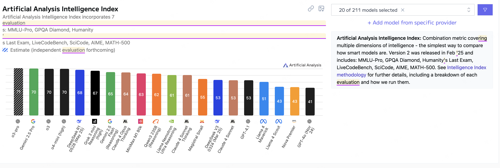
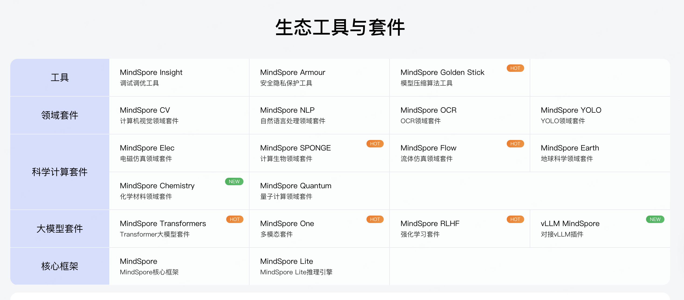

<p align="center">
  
</p>

<p align="center"> 
  <a href="https://github.com/tingaicompass/AI-Compass/stargazers">
    
  </a>
  <a href="./picture/main/wx.png">
    
  </a>
  <a href="https://blog.csdn.net/sinat_39620217?type=blog">
    
  </a>
   <a href="./picture/minor/KnowledgePlanet.md">
    
  </a>
  <a href="https://www.zhihu.com/people/tingaicompass">
    
  </a>
  <a href="https://juejin.cn/user/4020284493662029">
    
  </a>
</p>

---

## 📖 Project Overview

**AI-Compass** is positioned as a comprehensive AI technology navigation platform, dedicated to building a complete AI learning and practice ecosystem. The project systematically organizes cutting-edge AI technologies, tools, frameworks, and application cases, providing AI learners and practitioners with one-stop resource navigation services.

### 🎯 Core Module Architecture

```
AI-Compass
├── 🧭 AI Navigation Toolset          # Comprehensive AI tool collection
├── 📝 Prompt Engineering             # Prompt design and optimization
├── 📊 LLM Evaluation Leaderboard     # Large model performance benchmarks
├── 🤖 LLM Collection                 # Language and multimodal models
├── 🔧 Technical Framework Module     # Training/inference/evaluation frameworks
├── 💼 Application Practice Module    # MCP+A2A, RAG, Agent, etc.
├── 🌟 AI Applications               # AI programming and multimedia creation
├── 🏢 Enterprise Open Source Module # Datawhale, Huawei, Tencent, Alibaba, Paddle
└── 🌐 Community & Platform Module   # Learning platforms, forums, academic tools
```

### 👥 Target Audience

- **AI Beginners**: Systematic learning paths and foundational resource guidance
- **Algorithm Engineers**: Cutting-edge model architectures and optimization techniques
- **Application Developers**: Complete technical stacks and practical cases
- **Researchers**: Latest papers, datasets, and evaluation benchmarks
- **Enterprise Teams**: Production-ready solutions and best practices

---

## Contents

### 🧭 AI Navigation & Tools Module
- [1. AI Navigation Toolset](#1-ai-navigation-toolset)
- [2. Prompt Engineering](#2-prompt-engineering)
- [3. LLM Evaluation Leaderboard](#3-llm-evaluation-leaderboard)

### 🤖 LLM Core Module
- [4.1 LLM Collection (Language)](#41-llm-collection-language)
- [4.2 LLM Collection (Multimodal)](#42-llm-collection-multimodal)

### 🔧 Technical Framework Module
- [5.1 Embedding Models](#51-embedding-models)
- [5.2 LLM Training Frameworks](#52-llm-training-frameworks)
- [5.3 LLM Inference Frameworks + Deployment](#53-llm-inference-frameworks--deployment)
- [5.4 LLM Evaluation Frameworks](#54-llm-evaluation-frameworks)
- [5.5 RLHF](#55-rlhf)

### 💼 Application Practice Module
- [6.1 MCP+A2A](#61-mcpa2a)
- [6.2 RAG+Workflow](#62-ragworkflow)
- [6.3 Agent](#63-agent)
- [6.4 DeepSearch](#64-deepsearch)
- [6.5 GraphRAG](#65-graphrag)
- [6.6 NLP2SQL](#66-nlp2sql)
- [6.7 AI Popular Framework](#67-ai-popular-framework)

### 🌟 AI Applications Module
- [7.1 AI Applications](#71-ai-applications)
- [7.2 AI Products](#72-ai-products)
- [7.3 AI-LLM Competitions](#73-ai-llm-competitions)
- [7.4 AI Courses](#74-ai-courses)
- [7.5 AI Project Recommendations](#75-ai-project-recommendations)

### 🔬 Technical Specialization Module
- [8.1 Python](#81-python)
- [8.2 AI Databases](#82-ai-databases)
- [8.3 AI Visualization](#83-ai-visualization)
- [8.4 Machine Learning](#84-machine-learning)
- [8.5 Computer Vision](#85-computer-vision)
- [8.6 Recommender Systems](#86-recommender-systems)
- [8.7 Reinforcement Learning](#87-reinforcement-learning)
- [8.8 Knowledge Graphs](#88-knowledge-graphs)

### 🌐 Community & Platform Module
- [9. Learning Platforms](#9-learning-platforms)
- [9. Article Collections](#9-article-collections)
- [9. Community Forums](#9-community-forums)
- [9. Academic Tools](#9-academic-tools)
- [9. Interviews](#9-interviews)
- [9. Software](#9-software)

### 🏢 Enterprise Open Source Module
- [10. Datawhale](#10-datawhale)
- [10. Huawei Open Source](#10-huawei-open-source)
- [10. Tencent](#10-tencent)
- [10. Alibaba Open Source](#10-alibaba-open-source)
- [10. Paddle](#10-paddle)
---

## 🧭 AI Navigation & Tools Module

### [1. AI Navigation Toolset](./0.AI导航工具集/AI导航工具集.md)


The AI Navigation Toolset module builds a comprehensive AI tool ecosystem covering the entire lifecycle from model development to application deployment. This module systematically organizes 200+ mainstream AI tools and platforms, including OpenAI GPT series, Anthropic Claude, Google Gemini, and other leading large language models, as well as Midjourney, DALL-E, Stable Diffusion and other top AI image generation tools. The technical stack covers AI programming assistants like GitHub Copilot, Cursor, Replit, and CodeWhisperer, AI search engines like Perplexity, You.com, and Phind, as well as comprehensive AI platforms like Poe, Character.AI, and Hugging Face. The content includes AI video generation tools like Runway, Luma AI, and Kling, AI audio processing tools like ElevenLabs, Murf, and Speechify, as well as AI design tools like Canva, Figma AI, and Framer. The module also provides detailed introductions to AI workflow automation tools like Zapier, Make, and n8n, AI data analysis tools like Julius AI, DataRobot, and H2O.ai, as well as AI writing assistants like Jasper, Copy.ai, and Writesonic. Additionally, it covers AI code review tools, AI testing frameworks, AI monitoring platforms, and other development support tools, helping developers quickly locate the most suitable AI tools for their specific needs and build efficient AI application development workflows.

### [2. Prompt Engineering](./1.1%20Prompt工程/2.Prompt工程.md)


The Prompt Engineering module builds a complete prompt design and optimization ecosystem, providing systematic prompt engineering solutions for AI application developers. This module deeply organizes core knowledge systems including prompt design principles, optimization strategies, evaluation methods, and application practices, covering mainstream prompt frameworks like Chain-of-Thought (CoT), Tree of Thoughts (ToT), ReAct, and other advanced reasoning patterns. The technical stack includes prompt template libraries, automatic prompt optimization tools, prompt performance evaluation frameworks, and prompt security detection tools, with detailed analysis of prompt injection attacks, jailbreak techniques, and defense strategies. The content covers prompt engineering practices for different model types (GPT, Claude, Gemini, etc.), multi-turn dialogue management, context window optimization, and token cost control techniques. The module systematically introduces few-shot learning, in-context learning, instruction tuning, and other prompt optimization methods, as well as domain-specific prompt design patterns for code generation, creative writing, data analysis, and other application scenarios. Additionally, it provides rich prompt template libraries, best practice cases, A/B testing methods, and performance evaluation metrics, along with prompt version management, collaborative editing, and automated testing tools, helping developers master the complete prompt engineering workflow from design to deployment and achieve optimal AI model performance.

### [3. LLM Evaluation Leaderboard](./1.2%20LLM测评榜/1.大模型测评榜.md)




The LLM Evaluation Leaderboard module builds a comprehensive large language model performance evaluation ecosystem, providing systematic model selection and comparison solutions for AI researchers and practitioners. This module systematically organizes authoritative evaluation benchmarks including Chatbot Arena, LMSYS Leaderboard, OpenCompass, and other mainstream evaluation platforms, covering multiple evaluation dimensions such as general capabilities, reasoning abilities, code generation, mathematical problem-solving, and safety alignment. The technical stack includes automated evaluation frameworks, multi-dimensional scoring systems, real-time ranking updates, and cross-model comparison tools, with detailed analysis of evaluation methodologies, benchmark datasets, scoring criteria, and result interpretation. The content covers evaluation practices for different model scales (7B, 13B, 70B, etc.), multi-language evaluation, domain-specific benchmarks, and human preference alignment assessment. The module systematically introduces evaluation metrics like BLEU, ROUGE, BERTScore, and other automatic evaluation methods, as well as human evaluation, pairwise comparison, and Elo rating systems. Additionally, it provides comprehensive evaluation result analysis, model capability radar charts, performance trend tracking, and cost-effectiveness analysis, along with evaluation dataset construction, benchmark design principles, and evaluation result reproducibility verification, helping users scientifically select the most suitable large language models for their specific application scenarios and understand the current state and development trends of model capabilities.

**[⬆ Back to Contents](#contents)**

## 🤖 LLM Core Module

#### [4.1 LLM Collection (Language)](./1.3%20LLM合集-语言/1.LLM合集-语言.md)


The LLM Collection (Language) module builds a comprehensive large language model ecosystem covering models from foundational to specialized applications. This module systematically organizes 100+ mainstream language models including OpenAI GPT series (GPT-4, GPT-3.5), Anthropic Claude series, Google Gemini/PaLM, Meta LLaMA series, and other international leading models, as well as domestic excellent models like Baidu ERNIE, Alibaba Qwen, Tencent Hunyuan, ByteDance Doubao, and others. The technical stack covers different parameter scales from 7B to 175B+, different architecture types including Transformer, Mamba, and other innovative architectures, as well as different training paradigms like pre-training, instruction tuning, and RLHF. The content includes detailed technical specifications, performance benchmarks, API usage guides, and deployment solutions for each model, with in-depth analysis of model capabilities in text generation, dialogue interaction, code generation, mathematical reasoning, logical inference, and other core tasks. The module systematically introduces model selection strategies, fine-tuning methods, prompt optimization techniques, and cost-effectiveness analysis, as well as model compression, quantization, distillation, and other optimization techniques. Additionally, it provides comprehensive model comparison matrices, capability evaluation reports, application case studies, and best practice guides, along with model licensing information, commercial usage terms, and technical support channels, helping developers choose the most suitable language models for their specific needs and achieve optimal application performance and cost control.

#### [4.2 LLM Collection (Multimodal)](./1.4%20LLM合集-多模态/多模态.md)

The LLM Collection (Multimodal) module builds a comprehensive multimodal large model ecosystem covering text, image, audio, video, and other modality fusion technologies. This module systematically organizes cutting-edge multimodal models including OpenAI GPT-4V, Google Gemini Vision, Anthropic Claude 3, Meta LLaVA, Microsoft KOSMOS, and other international leading models, as well as domestic innovative models like Alibaba Qwen-VL, Baidu ERNIE-VilG, Tencent CogVLM, and others. The technical stack covers vision-language models, audio-language models, video-language models, and omni-modal models, with detailed analysis of multimodal fusion architectures, cross-modal attention mechanisms, and multimodal alignment training strategies. The content includes technical implementations for image understanding, visual question answering, image captioning, visual reasoning, audio processing, video analysis, and other core capabilities, with in-depth exploration of multimodal prompt engineering, few-shot learning, and in-context learning techniques. The module systematically introduces multimodal data preprocessing, model training pipelines, evaluation benchmarks, and deployment optimization methods, as well as multimodal retrieval, generation, editing, and other advanced applications. Additionally, it provides comprehensive multimodal model comparison, capability evaluation matrices, application scenario analysis, and technical implementation guides, along with multimodal dataset resources, evaluation tools, and development frameworks, helping developers master the complete multimodal AI technology stack from model selection to application deployment and achieve innovative breakthroughs in cross-modal intelligent applications.

**[⬆ Back to Contents](#contents)**

## 🔧 Technical Framework Module

#### [5.1 Embedding Models](./2.0%20Embedding模型/2.Embedding模型.md)


The Embedding Models module builds a comprehensive text representation learning ecosystem, providing systematic vector representation solutions for AI application developers. This module systematically organizes 50+ mainstream embedding models including OpenAI text-embedding-ada-002, Cohere Embed, Sentence-BERT, BGE, E5, and other leading text embedding models, as well as specialized models for multilingual, domain-specific, and long-text scenarios. The technical stack covers different embedding dimensions (128, 256, 512, 1024, etc.), different training objectives (contrastive learning, masked language modeling, etc.), and different application scenarios (semantic search, text classification, clustering analysis, etc.). The content includes detailed technical principles, performance benchmarks, API usage guides, and deployment solutions for each model, with in-depth analysis of embedding quality evaluation, similarity calculation methods, and vector database integration strategies. The module systematically introduces embedding fine-tuning techniques, domain adaptation methods, multilingual alignment strategies, and computational efficiency optimization, as well as embedding visualization, dimensionality reduction, and interpretability analysis techniques. Additionally, it provides comprehensive embedding model comparison matrices, benchmark evaluation results, application case studies, and best practice guides, along with vector storage solutions, similarity search algorithms, and embedding service deployment architectures, helping developers choose the most suitable embedding models for their specific needs and build efficient semantic understanding and retrieval systems.

#### [5.2 LLM Training Frameworks](./2.1%20LLM训练框架/2.大模型训练框架.md)


The LLM Training Frameworks module builds a comprehensive large language model training ecosystem, providing systematic model training solutions for AI researchers and engineers. This module systematically organizes mainstream training frameworks including Transformers, DeepSpeed, FairScale, Megatron-LM, ColossalAI, and other distributed training platforms, as well as specialized frameworks like Alpaca, Vicuna, FastChat for instruction tuning and alignment training. The technical stack covers data parallel, model parallel, pipeline parallel, and other distributed training strategies, with detailed analysis of gradient accumulation, mixed precision training, gradient checkpointing, and other memory optimization techniques. The content includes complete training pipelines from data preprocessing, tokenization, model initialization to training monitoring, evaluation, and model saving, with in-depth exploration of learning rate scheduling, optimizer selection, regularization techniques, and hyperparameter tuning strategies. The module systematically introduces pre-training, fine-tuning, instruction tuning, and RLHF training paradigms, as well as LoRA, QLoRA, AdaLoRA, and other parameter-efficient fine-tuning methods. Additionally, it provides comprehensive training framework comparison, performance benchmarks, resource consumption analysis, and cost optimization strategies, along with training monitoring tools, debugging techniques, and troubleshooting guides, helping developers master the complete large model training workflow from environment setup to model deployment and achieve efficient and stable model training results.

#### [5.3 LLM Inference Frameworks + Deployment](./2.2%20LLM推理框架+部署/2.LLM训练推理加速框架+部署.md)


The LLM Inference Frameworks + Deployment module builds a comprehensive large language model inference and deployment ecosystem, providing systematic model serving solutions for AI application developers. This module systematically organizes mainstream inference frameworks including vLLM, TensorRT-LLM, Text Generation Inference (TGI), LMDeploy, and other high-performance inference engines, as well as deployment platforms like Ollama, LocalAI, FastChat, and OpenLLM for local and cloud deployment. The technical stack covers model quantization (INT8, INT4, FP16), model compression, dynamic batching, continuous batching, and other inference optimization techniques, with detailed analysis of GPU memory management, KV cache optimization, and parallel inference strategies. The content includes complete deployment workflows from model conversion, optimization, containerization to service deployment, load balancing, and monitoring, with in-depth exploration of API design, request routing, auto-scaling, and fault tolerance mechanisms. The module systematically introduces different deployment scenarios including edge deployment, cloud deployment, hybrid deployment, and multi-cloud deployment, as well as performance optimization, cost control, and security protection strategies. Additionally, it provides comprehensive inference framework comparison, performance benchmarks, throughput analysis, and latency optimization guides, along with deployment automation tools, monitoring dashboards, and troubleshooting solutions, helping developers achieve efficient, stable, and cost-effective large model inference services from model optimization to production deployment.

#### [5.4 LLM Evaluation Frameworks](./2.3%20LLM评估框架/2.LLM模型评估.md)


The LLM Evaluation Frameworks module builds a comprehensive large language model evaluation ecosystem, providing systematic model assessment solutions for AI researchers and practitioners. This module systematically organizes mainstream evaluation frameworks including OpenCompass, LM Evaluation Harness, HELM, BIG-bench, and other comprehensive evaluation platforms, as well as specialized evaluation tools for specific capabilities like code generation, mathematical reasoning, and safety alignment. The technical stack covers automatic evaluation, human evaluation, comparative evaluation, and other assessment methods, with detailed analysis of evaluation metrics, benchmark datasets, scoring systems, and result interpretation strategies. The content includes complete evaluation workflows from dataset preparation, model testing, result analysis to report generation, with in-depth exploration of evaluation reproducibility, bias detection, and fairness assessment techniques. The module systematically introduces different evaluation dimensions including general capabilities, domain expertise, reasoning abilities, safety alignment, and robustness testing, as well as evaluation automation, batch processing, and distributed evaluation strategies. Additionally, it provides comprehensive evaluation framework comparison, benchmark analysis, evaluation methodology guides, and best practice recommendations, along with evaluation result visualization, statistical analysis tools, and evaluation report templates, helping researchers and developers scientifically assess model capabilities, identify improvement directions, and make informed model selection decisions for their specific application requirements.

#### [5.5 RLHF](./2.4%20RLHF/2.RLHF.md)


The RLHF (Reinforcement Learning from Human Feedback) module builds a comprehensive human feedback-based model alignment ecosystem, providing systematic model optimization solutions for AI safety and alignment researchers. This module systematically organizes RLHF implementation frameworks including TRL (Transformer Reinforcement Learning), DeepSpeed-Chat, ColossalAI-Chat, and other specialized training platforms, as well as human preference datasets like Anthropic HH, OpenAI WebGPT, and Stanford SHP. The technical stack covers reward model training, PPO (Proximal Policy Optimization) fine-tuning, DPO (Direct Preference Optimization), and other alignment training algorithms, with detailed analysis of human preference collection, reward signal design, and policy optimization strategies. The content includes complete RLHF workflows from preference data annotation, reward model training, policy optimization to safety evaluation, with in-depth exploration of constitutional AI, red teaming, and adversarial testing techniques. The module systematically introduces different alignment objectives including helpfulness, harmlessness, honesty, and other human values, as well as scalable oversight, AI feedback, and constitutional training methods. Additionally, it provides comprehensive RLHF framework comparison, training pipeline guides, evaluation methodologies, and safety assessment protocols, along with annotation tools, quality control systems, and alignment evaluation benchmarks, helping researchers and developers build safer, more aligned AI systems that better serve human values and intentions while maintaining high performance and capability.

**[⬆ Back to Contents](#contents)**

## 💼 Application Practice Module

#### [6.1 MCP+A2A](./3.0%20MCP+A2A/3.MCP+A2A.md)


The MCP+A2A module builds a comprehensive Model Context Protocol and Agent-to-Agent communication ecosystem, providing systematic multi-agent collaboration solutions for AI application developers. This module systematically organizes MCP (Model Context Protocol) implementation frameworks, A2A (Agent-to-Agent) communication protocols, and multi-agent orchestration platforms, covering mainstream frameworks like AutoGen, CrewAI, LangGraph, and other agent collaboration tools. The technical stack includes agent communication protocols, context sharing mechanisms, task coordination strategies, and distributed agent architectures, with detailed analysis of message passing, state synchronization, and conflict resolution techniques. The content covers complete multi-agent workflows from agent definition, role assignment, communication setup to task execution and result aggregation, with in-depth exploration of agent personality design, capability modeling, and interaction patterns. The module systematically introduces different collaboration paradigms including hierarchical coordination, peer-to-peer communication, and hybrid architectures, as well as agent discovery, registration, and lifecycle management strategies. Additionally, it provides comprehensive MCP protocol specifications, A2A communication standards, implementation guides, and best practice examples, along with debugging tools, monitoring dashboards, and performance optimization techniques, helping developers build robust, scalable, and efficient multi-agent systems that can handle complex tasks through intelligent collaboration and coordination.

#### [6.2 RAG+Workflow](./3.1%20RAG+workflow/3.RAG+workflow.md)


The RAG+Workflow module builds a comprehensive Retrieval-Augmented Generation and workflow automation ecosystem, providing systematic knowledge-enhanced AI solutions for enterprise applications. This module systematically organizes 50+ RAG frameworks including LangChain, LlamaIndex, Haystack, Chroma, and other retrieval-augmented generation platforms, as well as workflow orchestration tools like Dify, Flowise, and LangFlow. The technical stack covers vector databases, embedding models, retrieval algorithms, and generation pipelines, with detailed analysis of chunking strategies, similarity search, re-ranking, and context fusion techniques. The content includes complete RAG workflows from document ingestion, preprocessing, indexing to query processing, retrieval, and generation, with in-depth exploration of hybrid search, multi-modal retrieval, and real-time updates. The module systematically introduces different RAG architectures including naive RAG, advanced RAG, and modular RAG, as well as evaluation metrics, optimization strategies, and production deployment considerations. Additionally, it provides comprehensive RAG framework comparison, performance benchmarks, workflow design patterns, and implementation guides, along with monitoring tools, debugging techniques, and cost optimization strategies, helping developers build intelligent knowledge systems that combine the power of large language models with enterprise knowledge bases for accurate, contextual, and up-to-date AI applications.

#### [6.3 Agent](./3.2%20Agent/3.Agent.md)


The Agent module builds a comprehensive intelligent agent ecosystem covering 70+ mainstream frameworks, providing systematic autonomous AI solutions for complex task automation. This module systematically organizes leading agent frameworks including AutoGPT, LangChain Agents, AutoGen, CrewAI, MetaGPT, and other autonomous agent platforms, as well as specialized frameworks for different domains like code generation, data analysis, and task planning. The technical stack covers agent architectures, planning algorithms, tool integration, and memory management, with detailed analysis of reasoning chains, action selection, and environment interaction mechanisms. The content includes complete agent development workflows from agent design, capability definition, tool configuration to task execution and performance evaluation, with in-depth exploration of multi-agent collaboration, hierarchical planning, and adaptive learning techniques. The module systematically introduces different agent types including reactive agents, deliberative agents, and hybrid architectures, as well as agent communication protocols, coordination strategies, and conflict resolution mechanisms. Additionally, it provides comprehensive agent framework comparison, capability matrices, implementation tutorials, and best practice guides, along with debugging tools, monitoring systems, and performance optimization techniques, helping developers build intelligent, autonomous, and reliable agent systems that can handle complex real-world tasks with minimal human intervention while maintaining safety and controllability.

#### [6.4 DeepSearch](./3.3%20DeepSearch/3.DeepSearch.md)


The DeepSearch module builds a comprehensive deep search technology ecosystem covering cutting-edge platforms and advanced search methodologies. This module systematically organizes next-generation search platforms including Perplexity AI, You.com, Phind, Kagi, and other AI-powered search engines, as well as specialized search tools for academic research, code search, and domain-specific information retrieval. The technical stack covers semantic search, neural information retrieval, multi-modal search, and real-time search capabilities, with detailed analysis of embedding-based retrieval, re-ranking algorithms, and search result synthesis techniques. The content includes complete deep search workflows from query understanding, intent recognition, multi-source retrieval to result aggregation, fact verification, and answer generation, with in-depth exploration of search personalization, context awareness, and conversational search interfaces. The module systematically introduces different search paradigms including traditional keyword search, semantic search, and AI-augmented search, as well as search quality evaluation, relevance scoring, and user experience optimization strategies. Additionally, it provides comprehensive search platform comparison, performance benchmarks, integration guides, and implementation best practices, along with search analytics tools, query optimization techniques, and search result quality assessment methods, helping developers and researchers build intelligent search systems that deliver accurate, comprehensive, and contextually relevant information through advanced AI-powered search technologies.

#### [6.5 GraphRAG](./3.4%20GraphRAG/3.GraphRAG.md)


The GraphRAG module builds a comprehensive Graph Retrieval-Augmented Generation technology ecosystem, providing systematic graph-enhanced knowledge retrieval solutions for complex reasoning applications. This module systematically organizes GraphRAG implementation frameworks including Microsoft GraphRAG, Neo4j GraphRAG, LlamaIndex Graph, and other graph-based retrieval platforms, as well as graph databases like Neo4j, ArangoDB, and TigerGraph for knowledge storage and querying. The technical stack covers knowledge graph construction, graph embedding, graph neural networks, and graph-aware retrieval algorithms, with detailed analysis of entity linking, relation extraction, graph traversal, and subgraph retrieval techniques. The content includes complete GraphRAG workflows from knowledge graph construction, graph indexing, query processing to graph-based retrieval, reasoning, and answer generation, with in-depth exploration of multi-hop reasoning, path finding, and graph-based context aggregation. The module systematically introduces different graph architectures including property graphs, RDF graphs, and hypergraphs, as well as graph query languages, graph algorithms, and graph visualization techniques. Additionally, it provides comprehensive GraphRAG framework comparison, performance evaluation, implementation tutorials, and optimization strategies, along with graph construction tools, query optimization techniques, and graph quality assessment methods, helping developers build intelligent knowledge systems that leverage graph structures for enhanced reasoning, complex query answering, and contextual information retrieval in domain-specific applications.

#### [6.6 NLP2SQL](./3.5%20NLP2SQL/3.NL2SQL.md)


The NLP2SQL module builds a comprehensive natural language to SQL conversion technology ecosystem, providing systematic database query automation solutions for business intelligence and data analytics applications. This module systematically organizes NLP2SQL frameworks including Text-to-SQL models, Spider benchmark, WikiSQL, and other natural language database interfaces, as well as specialized tools like Vanna AI, SQLCoder, and CodeT5 for SQL generation and optimization. The technical stack covers semantic parsing, schema linking, query planning, and SQL optimization, with detailed analysis of table understanding, column mapping, join reasoning, and aggregation handling techniques. The content includes complete NLP2SQL workflows from schema analysis, question understanding, SQL generation to query execution, result interpretation, and error handling, with in-depth exploration of few-shot learning, in-context learning, and fine-tuning strategies for domain adaptation. The module systematically introduces different approaches including template-based methods, neural semantic parsing, and large language model-based generation, as well as evaluation metrics, benchmark datasets, and performance optimization techniques. Additionally, it provides comprehensive NLP2SQL framework comparison, accuracy benchmarks, implementation guides, and best practice recommendations, along with query validation tools, SQL optimization techniques, and database integration strategies, helping developers build intelligent data query systems that enable non-technical users to access and analyze database information through natural language interfaces while ensuring query accuracy and performance.

#### [6.7 AI Popular Framework](./3.6%20AI%20Popular%20Framework/3.AI%20Popular%20Framework.md)


The AI Popular Framework module builds a comprehensive AI application development technology ecosystem, covering mainstream frameworks and tools for building production-ready AI applications. This module systematically organizes popular AI development frameworks including Streamlit, Gradio, FastAPI, Flask, and other web application frameworks, as well as specialized platforms like Hugging Face Spaces, Replicate, and Modal for AI model deployment and sharing. The technical stack covers frontend frameworks, backend services, API development, and cloud deployment platforms, with detailed analysis of model serving, user interface design, and application architecture patterns. The content includes complete AI application development workflows from prototype creation, user interface design, model integration to deployment, monitoring, and scaling, with in-depth exploration of responsive design, real-time inference, and user experience optimization. The module systematically introduces different development approaches including low-code platforms, full-stack frameworks, and microservices architectures, as well as authentication, security, and performance optimization strategies. Additionally, it provides comprehensive framework comparison, development tutorials, deployment guides, and best practice examples, along with debugging tools, monitoring solutions, and scaling strategies, helping developers rapidly build, deploy, and maintain AI-powered applications that deliver seamless user experiences while ensuring reliability, security, and scalability in production environments.

**[⬆ Back to Contents](#contents)**

## 🌟 AI Applications Module

#### [7.1 AI Applications](./4.AI%20应用/4.AI应用.md)

The AI Applications module builds a comprehensive AI application ecosystem covering AI programming, multimedia creation, and enterprise-level solutions. This module systematically organizes AI programming tools including GitHub Copilot, Cursor, Replit, CodeWhisperer, and other intelligent coding assistants, as well as AI content creation platforms like Midjourney, DALL-E, Runway, and Luma AI for image, video, and audio generation. The technical stack covers code generation, debugging assistance, automated testing, and deployment automation, with detailed analysis of prompt engineering for coding, code review automation, and development workflow optimization. The content includes AI-powered design tools, writing assistants, data analysis platforms, and business automation solutions, with in-depth exploration of AI integration patterns, user experience design, and productivity enhancement strategies. The module systematically introduces different application categories including developer tools, creative applications, business intelligence, and enterprise automation, as well as integration strategies, customization options, and ROI optimization techniques. Additionally, it provides comprehensive application reviews, feature comparisons, implementation guides, and use case studies, along with integration tutorials, best practice recommendations, and cost-benefit analysis, helping individuals and organizations identify, evaluate, and implement AI applications that enhance productivity, creativity, and business outcomes across various domains and industries.

#### [7.2 AI Products](./5.AI产品/5.AI产品.md)

The AI Products module builds a comprehensive AI product ecosystem covering consumer applications, enterprise solutions, and specialized industry tools. This module systematically organizes AI-powered products including ChatGPT, Claude, Gemini, and other conversational AI platforms, as well as specialized products like Notion AI, Grammarly, Canva AI, and Adobe Firefly for productivity and creativity enhancement. The technical stack covers SaaS platforms, mobile applications, browser extensions, and desktop software, with detailed analysis of product features, pricing models, integration capabilities, and user experience design. The content includes AI products for different industries including healthcare, finance, education, marketing, and customer service, with in-depth exploration of product positioning, competitive advantages, and market differentiation strategies. The module systematically introduces different product categories including B2C applications, B2B solutions, and API-first products, as well as product evaluation criteria, adoption strategies, and implementation considerations. Additionally, it provides comprehensive product reviews, feature matrices, pricing comparisons, and user feedback analysis, along with integration guides, migration strategies, and vendor evaluation frameworks, helping businesses and individuals make informed decisions about AI product adoption, understand the competitive landscape, and maximize the value of AI investments across their operations and workflows.

#### [7.3 AI-LLM Competitions](./6.AI-LLM比赛/6.AI-LLM比赛.md)

The AI-LLM Competitions module builds a comprehensive AI competition ecosystem covering algorithm contests, model challenges, and application development competitions. This module systematically organizes major AI competitions including Kaggle competitions, DrivenData challenges, AIcrowd contests, and other machine learning competitions, as well as specialized LLM challenges like HELM evaluations, BIG-bench assessments, and domain-specific benchmarks. The technical stack covers competition platforms, evaluation frameworks, submission systems, and leaderboard mechanisms, with detailed analysis of competition formats, evaluation metrics, and winning strategies. The content includes competitions across different domains including computer vision, natural language processing, speech recognition, and multimodal AI, with in-depth exploration of data science competitions, hackathons, and research challenges. The module systematically introduces different competition types including individual contests, team competitions, and corporate challenges, as well as preparation strategies, solution development, and post-competition analysis techniques. Additionally, it provides comprehensive competition calendars, past solution analyses, winning approach summaries, and participant interviews, along with preparation resources, team formation strategies, and skill development guides, helping data scientists, researchers, and AI practitioners participate effectively in competitions, learn from top performers, and advance their skills through competitive machine learning and collaborative problem-solving experiences.

#### [7.4 AI Courses](./6.AI课程/6.AI课程.md)

The AI Courses module builds a comprehensive AI education ecosystem covering foundational learning to advanced specialization across multiple learning platforms and institutions. This module systematically organizes AI courses from leading platforms including Coursera, edX, Udacity, and other online education providers, as well as university courses from Stanford, MIT, Carnegie Mellon, and other top institutions. The technical stack covers machine learning fundamentals, deep learning architectures, natural language processing, computer vision, and reinforcement learning, with detailed analysis of course curricula, learning objectives, and skill development pathways. The content includes both theoretical foundations and practical implementations, with in-depth exploration of hands-on projects, coding assignments, and real-world applications. The module systematically introduces different learning formats including MOOCs, specialization programs, nanodegrees, and bootcamps, as well as certification options, career preparation, and industry alignment strategies. Additionally, it provides comprehensive course reviews, difficulty assessments, prerequisite requirements, and learning outcome evaluations, along with study guides, project portfolios, and career transition resources, helping learners at all levels choose appropriate educational paths, develop comprehensive AI skills, and advance their careers in artificial intelligence through structured, high-quality educational programs that combine theoretical knowledge with practical experience.

#### [7.5 AI Project Recommendations](./7.AI项目推荐/7.AI项目推荐.md)

The AI Project Recommendations module builds a comprehensive AI project ecosystem covering beginner tutorials to advanced research implementations across various domains and difficulty levels. This module systematically organizes AI projects including GitHub repositories, open-source implementations, research reproductions, and tutorial projects, covering areas like computer vision, natural language processing, machine learning, and deep learning applications. The technical stack includes project templates, implementation guides, dataset resources, and deployment instructions, with detailed analysis of project complexity, required skills, and learning outcomes. The content covers projects for different purposes including learning exercises, portfolio development, research exploration, and production applications, with in-depth exploration of project planning, development workflows, and best practices. The module systematically introduces different project categories including end-to-end applications, algorithm implementations, research papers reproduction, and industry case studies, as well as project evaluation criteria, contribution guidelines, and collaboration opportunities. Additionally, it provides comprehensive project reviews, difficulty ratings, skill requirements, and completion timelines, along with development resources, troubleshooting guides, and community support channels, helping developers, students, and researchers find suitable projects for skill development, build impressive portfolios, and contribute to the open-source AI community while gaining practical experience in implementing and deploying AI solutions.

**[⬆ Back to Contents](#contents)**

## 🔬 Technical Specialization Module

#### [8.1 Python](./8.0%20Python/PY.md)

The Python module builds a comprehensive Python technology ecosystem covering the complete technology stack from foundational programming to AI application development. This module systematically organizes Python learning resources including official documentation, tutorial collections, best practice guides, and advanced programming techniques, covering core libraries like NumPy, Pandas, Matplotlib, and other data science tools, as well as AI frameworks like TensorFlow, PyTorch, Scikit-learn, and other machine learning libraries. The technical stack includes web development frameworks like Django, Flask, FastAPI, data processing tools, automation scripts, and deployment solutions, with detailed analysis of Python syntax, object-oriented programming, functional programming, and performance optimization techniques. The content covers Python applications in different domains including web development, data analysis, machine learning, automation, and scientific computing, with in-depth exploration of package management, virtual environments, testing frameworks, and code quality tools. The module systematically introduces different Python development paradigms including scripting, application development, and library creation, as well as debugging techniques, profiling methods, and deployment strategies. Additionally, it provides comprehensive Python resource collections, learning paths, project examples, and best practice guides, along with development tools, IDE configurations, and community resources, helping developers master Python programming from basics to advanced applications and build robust, efficient, and maintainable Python applications for various use cases and industries.

#### [8.2 AI Databases](./8.1%20AI数据库/8.AI数据库.md)

The AI Databases module builds a comprehensive intelligent data storage and retrieval ecosystem covering vector databases, graph databases, and AI-optimized data management solutions. This module systematically organizes 20+ mainstream vector databases including Pinecone, Chroma, Weaviate, Qdrant, Milvus, and other specialized vector storage platforms, as well as graph databases like Neo4j, ArangoDB, and TigerGraph for knowledge representation and reasoning. The technical stack covers embedding storage, similarity search, distributed indexing, and real-time updates, with detailed analysis of vector indexing algorithms, similarity metrics, and query optimization techniques. The content includes database selection criteria, performance benchmarks, scalability considerations, and integration patterns for AI applications, with in-depth exploration of hybrid search, multi-modal indexing, and federated query processing. The module systematically introduces different database architectures including cloud-native solutions, on-premises deployments, and hybrid configurations, as well as data migration strategies, backup solutions, and disaster recovery planning. Additionally, it provides comprehensive database comparison matrices, performance evaluations, implementation guides, and optimization strategies, along with monitoring tools, administration interfaces, and cost analysis frameworks, helping developers and data engineers choose appropriate database solutions for AI applications, implement efficient data storage and retrieval systems, and ensure optimal performance, scalability, and reliability for vector search, knowledge graphs, and intelligent data management requirements.

#### [8.3 AI Visualization](./8.2%20AI可视化/8.AI可视.md)

The AI Visualization module builds a comprehensive AI model and data visualization ecosystem covering model interpretability, training monitoring, and interactive data exploration tools. This module systematically organizes visualization frameworks including TensorBoard, Weights & Biases, MLflow, and other experiment tracking platforms, as well as specialized tools like LIME, SHAP, Captum for model explainability and interpretation. The technical stack covers training visualization, model architecture diagrams, performance dashboards, and interactive exploration interfaces, with detailed analysis of visualization design principles, user experience optimization, and real-time monitoring capabilities. The content includes visualization solutions for different AI domains including computer vision, natural language processing, and time series analysis, with in-depth exploration of attention visualization, embedding projections, and decision boundary plotting. The module systematically introduces different visualization approaches including static charts, interactive dashboards, and immersive experiences, as well as visualization best practices, accessibility considerations, and performance optimization techniques. Additionally, it provides comprehensive visualization tool comparisons, implementation tutorials, design guidelines, and use case studies, along with customization options, integration strategies, and deployment considerations, helping data scientists, researchers, and AI practitioners create effective visualizations that enhance model understanding, facilitate debugging and optimization, and communicate AI insights to both technical and non-technical stakeholders through clear, informative, and engaging visual representations.

#### [8.4 Machine Learning](./8.3%20ML/ML.md)

The Machine Learning module builds a comprehensive machine learning technology ecosystem covering algorithmic foundations, implementation frameworks, and practical applications across various domains. This module systematically organizes ML algorithms including supervised learning, unsupervised learning, and reinforcement learning approaches, covering frameworks like Scikit-learn, XGBoost, LightGBM, and other classical machine learning libraries, as well as specialized tools for feature engineering, model selection, and hyperparameter optimization. The technical stack includes data preprocessing, feature selection, model training, and evaluation pipelines, with detailed analysis of algorithm selection criteria, performance metrics, and cross-validation strategies. The content covers ML applications in different industries including finance, healthcare, e-commerce, and manufacturing, with in-depth exploration of ensemble methods, automated machine learning (AutoML), and model interpretability techniques. The module systematically introduces different ML paradigms including batch learning, online learning, and transfer learning, as well as model deployment, monitoring, and maintenance strategies. Additionally, it provides comprehensive algorithm comparisons, implementation guides, best practice recommendations, and case study analyses, along with debugging techniques, performance optimization methods, and production deployment considerations, helping data scientists and ML engineers master the complete machine learning workflow from problem formulation to solution deployment and achieve optimal model performance, reliability, and business impact in real-world applications.

#### [8.5 Computer Vision](./8.4%20CV/8.CV.md)


The Computer Vision module builds a comprehensive computer vision technology ecosystem covering image processing, object detection, and advanced visual AI applications. This module systematically organizes CV frameworks including OpenCV, PyTorch Vision, TensorFlow Vision, and other image processing libraries, covering state-of-the-art models like YOLO, R-CNN, Transformer-based architectures, and other detection and segmentation algorithms. The technical stack includes image preprocessing, feature extraction, model training, and inference optimization, with detailed analysis of convolutional neural networks, attention mechanisms, and multi-scale processing techniques. The content covers CV applications across different domains including autonomous driving, medical imaging, surveillance, and augmented reality, with in-depth exploration of object detection, semantic segmentation, instance segmentation, and image generation techniques. The module systematically introduces different CV paradigms including traditional computer vision, deep learning approaches, and hybrid methods, as well as real-time processing, edge deployment, and mobile optimization strategies. Additionally, it provides comprehensive model comparisons, performance benchmarks, implementation tutorials, and optimization guides, along with dataset resources, evaluation metrics, and deployment frameworks, helping computer vision engineers and researchers develop robust, efficient, and accurate visual AI systems that can handle complex real-world scenarios while meeting performance, accuracy, and computational requirements for various applications and deployment environments.

#### [8.6 Recommender Systems](./8.5%20RecommenderSystem/推荐系统.md)


The Recommender Systems module builds a comprehensive recommendation technology ecosystem covering algorithmic theory, engineering architecture, and business practices, providing systematic personalized recommendation solutions for recommendation engineers. This module deeply organizes key knowledge systems including recommendation algorithm core technologies, search engine technologies, recommendation system columns, and recommendation system engineering practices, as well as technical characteristics and application scenarios of 10+ mainstream vector databases including Pinecone, Chroma, Faiss, LanceDB, Vald, deeplake, Elasticsearch, Milvus, Qdrant, and Weaviate. The technical stack covers core recommendation system components including index construction, recall strategies, and coarse ranking algorithms, with detailed analysis of implementation principles and optimization methods for key technologies like vector retrieval, similarity computation, multi-path recall, and feature engineering. The module systematically introduces mainstream algorithms including collaborative filtering, content filtering, deep learning recommendations, and graph neural network recommendations, as well as solutions for engineering challenges like cold start, data sparsity, real-time processing, and scalability. The content includes complete recommendation workflows including user profiling, item feature extraction, CTR prediction, and ranking optimization, as well as productization and operational technologies like A/B testing, online learning, and multi-objective optimization. Additionally, it provides case analyses of typical business scenarios including e-commerce recommendations, content recommendations, advertising recommendations, and social recommendations, as well as engineering practice guidance for large-scale distributed deployment, real-time recommendation services, and recommendation effectiveness evaluation, helping developers build high-performance, highly available recommendation systems that achieve precise personalized recommendations and maximize business value.

#### [8.7 Reinforcement Learning](./8.6%20RL/RL.md)


The Reinforcement Learning module builds a comprehensive RL technology ecosystem from theoretical learning to project implementation, providing systematic intelligent decision-making solutions for reinforcement learning researchers and engineers. This module systematically organizes classic theoretical textbooks including Mushroom Book and Deep Reinforcement Learning Principles and Practice, as well as 10+ mainstream reinforcement learning frameworks and toolkits including Google Dopamine, Facebook ReAgent, Ray, DI-ENGINE, ElegantRL, MARL library, SLM Lab, Spinning Up in Deep RL, Stable Baselines3, and Tianshou. The technical stack covers experimental platforms including Unity ML-Agents reinforcement learning environments and Gymnasium case collections, with in-depth introduction to implementation principles and application scenarios of single-agent algorithms like Rainbow, SAC, TD3, DDPG, A2C, PPO, and multi-agent algorithms like MADDPG and QMIX. The module provides detailed analysis of core technologies including value function approximation, policy gradient methods, deep reinforcement learning, and multi-agent collaboration, as well as solutions for key technical challenges like exploration-exploitation balance, sample efficiency optimization, and training stability. The content includes complete RL development workflows including environment modeling, reward design, network architecture, and hyperparameter tuning, as well as engineering practice technologies like distributed training, model deployment, and performance evaluation. Additionally, it provides rich project cases including Landlord AI, Honor of Kings AI, stock quantitative trading, Gomoku AI, and Poker AI, covering application domains like game AI, financial quantification, and strategic gaming, helping developers master the complete reinforcement learning technology stack from algorithm research to industrial applications and achieve intelligent solutions for complex decision-making problems.

#### [8.8 Knowledge Graphs](./8.7%20KnowledgeGraph/图谱.md)


The Knowledge Graphs module builds a comprehensive KG technology ecosystem from graph computing theory to knowledge engineering practice, providing systematic structured knowledge solutions for knowledge graph researchers and engineers. This module systematically organizes graph computing algorithm collections, knowledge graph-related learning materials, open knowledge graph tools and datasets, as well as technical characteristics and application scenarios of OGB graph neural network leaderboards, PyG, DGL, and other graph neural network libraries. The technical stack covers knowledge fusion tools like EAKit, LIMES, Silk, dedupe, openEA, knowledge graph construction tools like KG Lab, KGTK, deepdive, gBuilder, ontology editing tools like Protege, TopBraid, knowledge reasoning tools like FaCT++, Hermit, RDFox, and data cleaning tools like OpenRefine, forming a complete knowledge engineering toolchain. The module provides in-depth introduction to core technical components including entity recognition, relation extraction, knowledge fusion, and ontology construction, with detailed analysis of implementation principles and optimization methods for key technologies like graph neural networks, knowledge representation learning, graph database querying, and semantic reasoning. The content includes rich GitHub project cases such as security knowledge graphs, Jay Chou song queries, movie knowledge Q&A, subject knowledge graph learning platforms, Vue relationship graphs, automotive repair domain Q&A, doctor recommendation systems, psychological counseling Q&A, Chinese symptom Q&A, labor union knowledge graph visualization, KGCN, medical knowledge graph construction, Chinese character relationship knowledge graphs, Chinese compound event extraction, TextGrapher, and One Piece KG. Additionally, it provides multiple knowledge graph-related competition examples and evaluation benchmarks, as well as cutting-edge application directions like knowledge graph integration with large language models and GraphRAG retrieval enhancement, helping developers master the complete technology stack from graph data modeling to knowledge applications and achieve structured representation and intelligent reasoning of domain knowledge.
* [Open Source Graph Technology Tools](./8.7%20KnowledgeGraph/图谱2.md)
* [Knowledge Graph Systems and Platforms](./8.7%20KnowledgeGraph/图谱3.md)

**[⬆ Back to Contents](#contents)**


### 🌐 Community & Platform Module

#### [9.Learning Platforms](./9.学习平台/学习平台.md)
The Learning Platforms module builds a comprehensive AI education resource ecosystem covering complete learning paths from basic programming to cutting-edge large model technologies. This module carefully organizes high-quality programming learning platforms including GeekTime, Educoder practical teaching platform, Rookie Tutorial, and Liao Xuefeng's official website, as well as professional knowledge bases like CS-Books with over 1000 computer science classic books and Turing Community technical books. In AI cutting-edge technology aspects, the module brings together systematic courses like Microsoft AI-For-Beginners and generative-ai-for-beginners, as well as practical tutorials like ModelScope community's 7-day LLM large model introduction and Tongji Zihao's MCP learning. Special attention is given to large language model technology stacks, including cutting-edge resources like LLM-action large model engineering practices, DecryptPrompt paper summaries, and Awesome-Chinese-LLM open-source Chinese large model collections. The module also covers professional skill certification systems including Baidu AI Studio deep learning engineer certification, Alibaba Cloud DevOps assistant engineer certification, and Huawei Cloud certification, as well as authoritative learning resources like Machine Heart introductory tutorials and OpenAI reinforcement learning documentation, providing AI learners with full-stack skill development solutions from theoretical foundations to industrial practices, helping build systematic artificial intelligence knowledge systems and practical capabilities.

#### [9.Article Collections](./9.文章集/文章集.md)
The Article Collections module creates a premium content aggregation platform for AI technical knowledge, bringing together comprehensive technical article resources from basic theory to cutting-edge applications. This module centers on CS-Books with over 1000 computer science classic books, covering complete technology stacks including C/C++, Java, Python, Go language, data structures and algorithms, operating systems, backend architecture, computer networks, design patterns, as well as practical resources like campus and social recruitment interview experience summaries. In AI professional fields, the module integrates systematic tutorial resources like Siege Lion B-station course materials collections, artificial intelligence learning roadmap with 200 practical cases, and deep learning TensorFlow case practices. In technology frontiers, it includes authoritative content platforms like Papers With Code latest papers, Machine Heart SOTA model library, SyncedReview AI news, WaytoAGI knowledge base, as well as first-tier enterprise technical sharing from Meituan technical team, Amazon AWS official blog, and HyperAI super neural. The module particularly focuses on innovative content formats like bestblogs.dev large language model summary scoring assisted reading and artificial intelligence industry research, as well as developer exchange platforms like Wenwu Technology Cabinet and Open Github community, providing technical personnel with multi-dimensional knowledge acquisition channels to help build complete technical cognitive systems from theoretical learning to practical applications.

#### [9.Community Forums](./9.社区论坛/社区论坛.md)
The Community Forums module builds core communication hubs for AI technology ecosystems, bringing together comprehensive developer community resources from academic research to industrial applications. This module centers on top AI platforms including Alibaba Cloud Developer Community, Huawei AI Gallery, ModelScope, and Hugging Face, covering professional AI development environments like OpenBayes, Heywhale, OpenI, and Shizhiai, as well as international mainstream machine learning competition platforms like Google Colab and Kaggle. In deep learning framework ecosystems, the module integrates domestic framework communities including Huawei MindSpore, Baidu PaddlePaddle, Alibaba X-DeepLearning, Tencent NCNN, Megvii MegEngine, and OneFlow, as well as international cutting-edge framework resources like Meta Research, Microsoft CNTK, NVIDIA Megatron-LM, and Google JAX. Special attention is given to top technical conferences like QCon Global Software Development Conference and AICon AI Development Conference, as well as professional technical communities like CVmart CV developer platform, Beijing Academy of Artificial Intelligence, iFLYTEK Open Platform, and SenseTime SenseID. The module also covers distinctive technical activities like iFLYTEK 1024 Developer Festival and Hygon DCU Photosynthesis Developer Community, providing AI developers with full-chain community support systems from technical learning and project practice to career development.
* [9.Cloud Computing Power](./9.社区论坛/云算力.md)
* [9.Docker Hub Image Acceleration](./9.社区论坛/Dockerhub镜像加速.md)

#### [9.Academic Tools](./9.学术工具/学术工具.md)
The Academic Tools module builds a comprehensive support system for AI research workflows, providing complete toolchains from literature search to paper publication for researchers. This module centers on authoritative academic databases including IEEE Xplore, Papers With Code, and arXiv.org, integrating diversified literature search platforms like AMiner technology intelligence mining, Semantic Scholar, CNKI, and Engineering Village, as well as innovative search tools like Connected Papers paper correlation analysis, ResearchRabbit literature discovery, and Arxiv Sanity Preserver. In patent search aspects, it covers professional patent databases including Qizhidao patent search platform, Baiteng global patent search, HimmPat, and IPRDB, supporting free commercial patent queries and analysis report generation. Academic writing assistance tools include citexs Sate New Thinking research assistant, Little Green Whale English literature reader, ivySCI Ivy academic paper assistant, and other SCI reading efficiency improvement tools, as well as paper typesetting tools like authoritative terminology knowledge service and SVG/PDF format converters. The module also integrates academic integrity detection platforms including Lunwuyou dissertation detection, Wanfang data literature similarity detection, VIP paper detection system, and Yuanwen Jian plagiarism detection system, providing researchers with comprehensive academic research support from literature research and paper writing to plagiarism detection, helping improve research efficiency and academic quality.

#### [9.Interviews](./9.面试/面试.md)
The Interviews module builds a comprehensive support platform for AI technical talent job seeking and employment, covering the complete job search chain from resume creation to technical interviews. This module integrates professional resume creation through Quanmin Resume, mainstream job search and recruitment platforms including BOSS Zhipin, Maimai, Lagou, Liepin, 51job, and Haitou, providing diversified career development opportunities for AI talent. In technical capability improvement aspects, the module brings together top algorithm practice platforms including LeetCode, Niuke Tiba, and LintCode, as well as classic interview question banks like Programmer Interview Golden Code, Sword Pointing to Offer, and InterviewGuide algorithm interview guide, covering core technical areas including data structures, algorithm design, and system design. Professional skill assessment includes specialized technical interview resources like MySQL database interview eight-part essays, reinforcement learning algorithm interview questions, and deep learning interview question summaries, as well as practical training platforms like Tianchi LeetCode basic training camp, iFLYTEK AI programming questions, and EndlessCheng algorithm competition template library. The module particularly focuses on AI field professional interviews, organizing professional resources like reinforcement learning engineer interview guides, algorithm position interview preparation, and deep learning interview question summaries, as well as professional evaluation platforms like July Online AI written test and interview question bank and Saima online examination system, providing AI technical talent with full-stack job search support systems from basic capability development to professional skill certification.

#### [9.Software](./9.软件/软件.md)
The Software module builds a comprehensive tool ecosystem for AI developers, covering complete software toolchains from daily office work to professional development. This module integrates browser enhancement tools including Chrome Web Store extension plugins, Tampermonkey user script management, and iTab/WeTab new tab pages, as well as multimedia resource acquisition tools like Shuoshu, VideoGrabber, and YouTube downloaders. In data visualization aspects, it brings together professional drawing platforms including AntV Ant data visualization, Apache ECharts chart library, ProcessOn flowcharts, and HiPlot high-quality charts, as well as design resource libraries like research paper color schemes, Coolors color palette generators, and Unsplash high-quality image libraries. In development environment optimization, the module covers code editors including VS Code, Sublime Text, and Atom, as well as terminal enhancement tools like iTerm2, Oh My Zsh, and Windows Terminal, along with version control tools like Git GUI clients and GitHub Desktop. Professional development tools include API testing platforms like Postman and Insomnia, database management tools like Navicat and DBeaver, as well as system monitoring tools like Activity Monitor and Task Manager. The module also integrates productivity enhancement software including Alfred workflow automation, Raycast launcher, CleanMyMac system optimization, and Homebrew package management, providing developers with efficient, stable, and user-friendly development environments and productivity tools to support the complete workflow from daily office work to professional AI development.

**[⬆ Back to Contents](#contents)**

---

### 🏢 Enterprise Open Source Module

#### [10.Datawhale](./10.Datawhale/Datawhale.md)


The Datawhale module brings together high-quality educational resources from China's leading open-source learning community, focusing on systematic learning system construction in data science, machine learning, and artificial intelligence fields. This module systematically organizes core learning content from the Datawhale community, covering complete tutorial systems for multiple AI core areas including LLM large language models, Multi-Agent multi-agent systems, NLP natural language processing, reinforcement learning, data mining, graph deep learning, recommendation systems, YOLO object detection, and computer vision. The technical stack includes complete learning paths from theoretical foundations to practical applications, providing rich open-source textbooks, hands-on projects, code examples, and learning guides, with detailed introduction to technical architectures of LLM series courses, Multi-Agent collaboration mechanisms, NLP core algorithms, classic reinforcement learning cases, practical data mining techniques, and graph deep learning applications. The content also includes interview experience sharing and practical skills training like office automation, equipped with learning materials such as Jupyter Notebooks, Python code libraries, and dataset resources. Through open-source methods, it aggregates high-quality learners to collaboratively create and disseminate high-quality content, forming a complete AI learning ecosystem that helps learners rapidly improve AI technical capabilities and professional competitiveness in an open and collaborative environment.

#### [10.Huawei Open Source](./10.华为开源/华为.md)



The Huawei Open Source module showcases Huawei's significant open-source contributions and enterprise-level technical solutions in the artificial intelligence field, building a complete AI development ecosystem. This module systematically introduces core technical architectures of Huawei Cloud ModelArts one-stop AI development platform, AI Gallery model marketplace, Pangu large model series, and other cloud computing and AI services. The technical stack covers MindStudio development tools, complete AI learning roadmaps, competition platforms, and HarmonyOS operating system full-stack solutions, with in-depth analysis of the complete development experience from model training and deployment to applications. The content includes core technical features of the MindSpore deep learning framework such as automatic differentiation, graph optimization, and distributed training, key technologies of the Ascend AI processor ecosystem including architecture design, operator development, and performance optimization, as well as cutting-edge application directions like cloud-edge collaboration, federated learning, and AI security. The module provides detailed introduction to technical architectures, deployment solutions, performance benchmarks, and application cases of Huawei's AI full-stack solutions, covering the complete technical ecosystem from underlying hardware to upper-layer applications. Through open-source methods, Huawei provides developers with complete solutions from model training and deployment to applications, promoting AI technology popularization and industrial applications, forming a complete technical ecosystem from underlying hardware to upper-layer applications.

#### [10.Tencent](./10.腾讯/腾讯.md)

The Tencent module comprehensively showcases Tencent's technical accumulation and open-source contributions in the artificial intelligence field, building a complete AI technology ecosystem. This module systematically introduces technical architectures and application values of core platforms including Tencent Cloud, Tencent AI Lab, and Tencent Hunyuan large models. The technical stack covers Tencent Cloud TI platform TI-ONE one-stop machine learning services, Cloud+ community technical exchange platform, DAIR Lab decision intelligence laboratory, and other complete AI development and research systems, with detailed analysis of important breakthroughs and productization achievements in core AI technology directions including deep learning, computer vision, natural language processing, speech technology, and recommendation systems. Particularly noteworthy is the open-source cloud-native one-stop AI platform Cube Studio, providing developers with complete solutions from data processing and model training to deployment. The content covers AI technology practices from different business lines including Tencent Cloud AI services, Tencent YouTu Lab, and WeChat AI team, with in-depth analysis of innovative solutions in typical application scenarios like social networks, content recommendation, game AI, fintech, and smart healthcare. Through industry-academia-research integration, Tencent continues to innovate in multiple AI core areas including computer vision, natural language processing, and speech recognition, promoting deep applications of AI technology in social, gaming, finance, and other industries.

#### [10.Alibaba Open Source](./10.阿里开源/阿里.md)


The Alibaba Open Source module provides in-depth analysis of Alibaba Group's open-source strategy and technical contributions in the artificial intelligence field, building a complete AI open-source ecosystem map from underlying frameworks to upper-layer applications. This module systematically introduces technical features and application scenarios of core AI open-source projects including EasyNLP natural language processing framework, EasyRec large-scale recommendation algorithm framework, EasyCV computer vision framework, and EasyRL reinforcement learning platform. The technical stack also includes graph computing solutions like GraphScope one-stop ultra-large-scale graph computing system, TuGraph graph database, and AntV-G6 graph visualization framework, with detailed analysis of core open-source projects like Alink machine learning algorithm platform and DeepRec large-scale sparse model training framework. The content covers AI services including Alibaba Cloud ModelArts, Bailian large model platform, and intelligent open search, as well as technical popularization platforms like Tianchi competition platform and AI learning courses. The module provides in-depth analysis of technical innovations and engineering experiences in areas like e-commerce recommendation, intelligent customer service, image search, speech recognition, and knowledge graphs. From distributed training deployment to federated learning, Alibaba's open source provides complete technical support for AI industrialization. Additionally, it provides usage guides for Alibaba Cloud AI services, contribution methods for open-source projects, participation channels and learning resources for technical communities, as well as landing solutions and best practices for AI technology in enterprise digital transformation, helping developers comprehensively understand the development history and application value of Alibaba's AI technology.

#### [10.Paddle](./10.paddle/paddle1.md)


The Paddle module provides in-depth introduction to Baidu PaddlePaddle deep learning platform's full-stack technology system and industrial-level application practices, building a complete ecosystem from basic frameworks to industrial applications. This module systematically introduces functional features and usage methods of core technical components including PaddleNLP natural language processing suite, ERNIE series pre-trained models (ERNIE 3.0, ERNIE-Doc, ERNIE-Health, etc.), and UIE universal information extraction framework. The technical stack covers PaddleHub pre-trained model library, ERNIE large model ERNIEKit, Baidu Intelligent Cloud Qianfan large model platform, and other complete AI development ecosystems, with detailed analysis of core technical features including dynamic graph programming, static graph optimization, automatic differentiation, and distributed training. The content includes complete solutions from data processing, model training, compression deployment to service deployment, supporting various AI tasks like text classification, information extraction, machine translation, and image recognition, with in-depth exploration of efficient training technologies like mixed precision training, gradient accumulation, data parallelism, and model parallelism. The module also provides detailed introduction to AI Studio online development environment and rich industrial practice cases, as well as typical application cases and best practices of PaddlePaddle in areas like natural language processing, computer vision, speech recognition, and recommendation systems. Through AI Studio online development environment and rich industrial practice cases, PaddlePaddle provides developers with a complete AI development experience, building efficient and stable AI application solutions.
* [10.paddle2](./10.paddle/paddle2.md)

**[⬆ Back to Contents](#contents)**

## 🚀 Future Vision

AI-Compass is committed to becoming the most comprehensive and practical AI technology navigation platform, continuously tracking cutting-edge AI technologies and providing the community with the latest, most complete, and most valuable AI resources. We will continue to expand in the following directions:

## 🤝 Contributing

We welcome all forms of contributions! Whether it's:
- 📝 Content updates and additions
- 🐛 Error corrections and improvements
- 💡 New feature suggestions
- 🌟 Resource recommendations

Please feel free to submit Issues or Pull Requests to help us build a better AI navigation platform together.
---

## 🙏 Acknowledgments

Thanks to all contributors and the open-source community for their support and contributions to AI-Compass. Together, we are building a bridge to the future of artificial intelligence.

---

<div align="center">
  <p><strong>🧭 AI-Compass - Your AI Navigation Compass</strong></p>
  <p>Explore the infinite possibilities of artificial intelligence</p>
  <p>⭐ If this project helps you, please give us a star! ⭐</p>
</div>